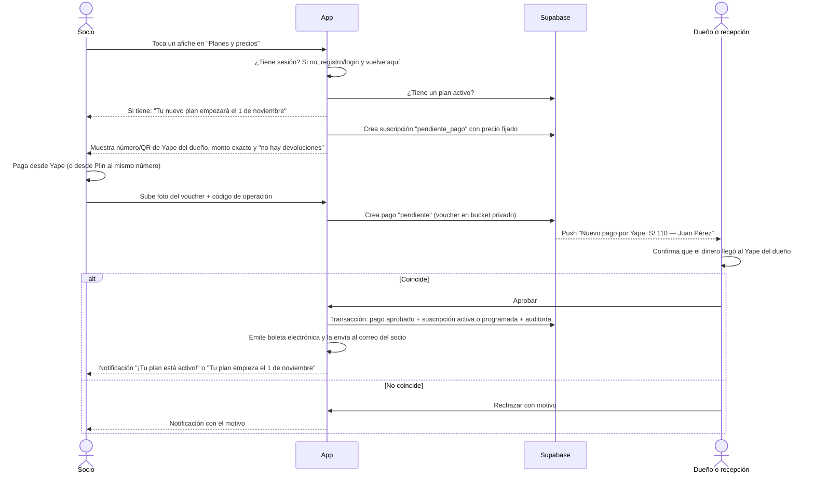

# PLAN — Aplicación URBAN FORCE GYM

> Documento de planificación. **No contiene código de la aplicación.**
> Gimnasio en Perú con **2 sedes**. Pensado para que un estudiante de 5.º ciclo de Ingeniería de Sistemas pueda construirlo paso a paso.

---

## 0. Resumen en una página

| Tema | Decisión |
|---|---|
| Tipo de app | Aplicación web instalable en el celular (**PWA**), *mobile-first* |
| Frontend + backend | **Next.js** (con **TypeScript**) |
| Estilos | **Tailwind CSS** con los colores de la marca (negro, amarillo dorado, blanco) |
| Base de datos, login y archivos | **Supabase** (PostgreSQL + Auth + Storage) |
| Hosting | **Vercel** |
| Pagos v1 | **Yape al número del dueño** + foto del voucher, aprobado por el dueño o la recepción · efectivo en recepción (0 % de comisión) |
| Pagos v2 | Pasarela **Izipay** (Yape + Plin + tarjetas). Alternativa: **Culqi** |
| Asistencia | **Código QR** personal del socio, escaneado en recepción, con **semáforo** verde / amarillo / rojo |
| Promociones | **Afiches (imágenes)** que suben el dueño y la recepción, iguales para las 2 sedes. Al tocarlos se va a pagar ese plan |
| Notificaciones | Dentro de la app + **notificaciones push** (llegan aunque la app esté cerrada) |
| Seguridad | Roles + **RLS por rol y por sede** en la base de datos |
| Boletas | **Boleta electrónica SUNAT enviada al correo** del socio (proveedor tipo Nubefact) |
| Horario | Lunes a sábado 6:00 a. m.–10:30 p. m. · Domingo 8:00 a. m.–3:00 p. m. · Feriados variable |
| Legal | **Ley N.º 29733** (datos personales), sin devoluciones informado antes de pagar, Libro de Reclamaciones virtual |

---

## 1. Tecnologías elegidas y por qué

### 1.1 Next.js (framework web)
- **Qué es:** un framework construido sobre React para hacer aplicaciones web completas.
- **Por qué:** en un solo proyecto tienes las pantallas (frontend) y la lógica del servidor (rutas API / *Server Actions*). No necesitas mantener dos proyectos separados.
- **Lo que usaremos:** el *App Router* (carpeta `app/`), páginas protegidas por rol y rutas API para recibir los avisos (*webhooks*) de la pasarela de pagos y para las tareas diarias.
- **Analogía:** es como tener recepción y almacén en el mismo local: todo cerca y ordenado.

### 1.2 TypeScript (lenguaje)
- **Qué es:** JavaScript con **tipos** (le dices al código que `precio` es un número y `dni` es un texto).
- **Por qué:** detecta errores **antes** de ejecutar. Por ejemplo, si intentas guardar una fecha donde va un monto, el editor te avisa. En una app con dinero (pagos) esto es muy importante.
- **Extra:** Supabase puede **generar los tipos automáticamente** a partir de tus tablas.

### 1.3 Tailwind CSS (estilos)
- **Qué es:** una forma de dar estilo usando clases cortas (`bg-black`, `text-yellow-400`, `p-4`) directamente en el HTML.
- **Por qué:** es rápido, fácil de mantener y viene pensado para **mobile-first** (primero diseñas para celular y luego agregas `md:` o `lg:` para pantallas grandes).
- **Lo que haremos:** definir los colores de la marca una sola vez en la configuración y usarlos en toda la app.

**Colores de marca (confirmados: amarillo y negro, medidos en el logo oficial):**
El logo oficial es un **hexágono amarillo con borde negro**, con el espartano "UF" y el texto **URBAN FORCE GYM**. Está guardado en `recursos/urban-force-logo.jpg` (recorte original) y en `recursos/urban-force-logo-hd.png` (ampliado 4 veces, 852 × 952 px, **mismo diseño**). Los colores se midieron directamente en la imagen:

| Nombre | Uso | Valor |
|---|---|---|
| `marca-negro` | Fondos, barra superior, textos sobre amarillo | `#0A0A0A` (medido) |
| `marca-amarillo` | Botones principales, resaltados | `#F0B400` (medido) |
| `marca-amarillo-oscuro` | Botón presionado, bordes | `#C79500` (derivado) |
| `marca-blanco` | Textos sobre negro (en el logo, la palabra "FORCE") | `#FFFFFF` |
| `gris-suave` | Textos secundarios | `#A3A3A3` |

Colores del **semáforo** (sección 2.7), separados de la marca para que no se confundan con el dorado:

| Nombre | Valor propuesto |
|---|---|
| `semaforo-verde` | `#16A34A` |
| `semaforo-amarillo` | `#FACC15` (con texto negro) |
| `semaforo-rojo` | `#DC2626` |

➡️ **Logo:** la versión HD sirve para la app y para los íconos de 192 y 512 px. La ampliación suaviza los bordes, pero no puede recuperar el detalle que se perdió al recortarlo de WhatsApp. Si más adelante se quiere un logo perfecto para imprimir, conviene **redibujarlo en vector (SVG) copiando exactamente el diseño**, sin cambiar nada.
➡️ Revisar el **contraste** (texto negro sobre dorado sí se lee; texto blanco sobre dorado **no**).
➡️ El semáforo **siempre** lleva también texto e ícono, no solo color, para personas con daltonismo. Como el amarillo del semáforo se parece al amarillo de la marca, el semáforo ocupa **toda la pantalla** para que no se confunda con un botón.

### 1.4 Supabase (base de datos + login + archivos)
- **Qué es:** un servicio en la nube que te da:
  - **PostgreSQL:** base de datos relacional (tablas, llaves foráneas, SQL de verdad).
  - **Auth:** registro e inicio de sesión (correo + contraseña, o enlace mágico).
  - **Storage:** para guardar las fotos de los vouchers de Yape, los afiches de promociones y las fotos de perfil.
  - **RLS (Row Level Security):** reglas **dentro de la base de datos** que deciden qué filas puede ver o modificar cada usuario.
- **Por qué:** te ahorra construir un servidor desde cero y el plan gratuito alcanza para empezar.
- **Clave:** aunque alguien "hackee" el frontend, **RLS impide** que un socio vea los datos de otro o que una recepcionista de la Sede A vea la caja de la Sede B.

### 1.5 Vercel (hosting)
- **Qué es:** la plataforma donde se publica la app (creada por los mismos autores de Next.js).
- **Por qué:** conectas tu repositorio de GitHub y **cada `git push` publica la app automáticamente**. Te da HTTPS gratis (obligatorio para PWA, notificaciones push y pagos).
- **Extra:** **Vercel Cron** sirve para tareas programadas: revisar cada mañana quién está por vencer, qué promociones terminan en 2 días y qué planes programados empiezan hoy.

### 1.6 PWA (Progressive Web App)
- **Qué es:** una web que se puede **instalar** en el celular como si fuera una app, con ícono propio y pantalla completa.
- **Por qué:** no pagas la Play Store (US$ 25) ni la App Store (US$ 99/año), y una sola versión sirve para Android y iPhone.
- **Cómo la instala el socio:**
  - **Android (Chrome):** abrir la web → menú ⋮ → **"Instalar aplicación"** (o "Agregar a pantalla principal"). Chrome también puede mostrar un aviso automático.
  - **iPhone (Safari):** abrir la web **en Safari** → botón **Compartir** (cuadrado con flecha) → **"Agregar a inicio"**. En iPhone **no** aparece un aviso automático, así que la app debe mostrar una pequeña guía con estos pasos.
- **Requisitos:** `manifest.json` (nombre, colores, íconos 192 px y 512 px) + HTTPS + *service worker*.

### 1.7 Notificaciones push (Web Push)
- **Qué es:** avisos que aparecen en la pantalla del celular **aunque la app esté cerrada**, igual que los de WhatsApp.
- **Cómo funciona:** el celular le da a la app una "dirección" única (*suscripción push*). El servidor guarda esa dirección y, cuando hay algo que avisar, le envía el mensaje usando unas llaves propias llamadas **VAPID**. El *service worker* del celular lo recibe y lo muestra.
- **Por qué:** es **gratis** (no hay que pagar por mensaje, a diferencia de WhatsApp o SMS).
- **Limitaciones que hay que conocer:**
  - **Android:** funciona en Chrome, incluso sin instalar la app.
  - **iPhone:** solo funciona si la app está **instalada en la pantalla de inicio** (iOS 16.4 o superior). Por eso la guía de instalación es importante.
  - El socio debe **aceptar el permiso** de notificaciones. Se pide con un botón ("Activar avisos"), nunca apenas abre la app.
  - Si el socio no acepta, igual ve los avisos **dentro** de la app (campanita).

### 1.8 Otras librerías (pequeñas)
| Librería | Para qué |
|---|---|
| `zod` | Validar formularios (DNI de 8 dígitos, celular de 9 dígitos que empieza con 9) |
| Generador de QR (p. ej. `qrcode`) | Mostrar el QR personal del socio |
| Lector de QR con cámara (p. ej. `html5-qrcode`) | Recepción escanea el QR desde el celular o la tablet |
| `date-fns` (con zona `America/Lima`) | Fechas de vencimiento, domingos y feriados |
| `web-push` | Enviar las notificaciones push desde el servidor |
| Compresor de imágenes (p. ej. `browser-image-compression`) | Reducir el peso de los afiches antes de subirlos |
| Resend o WhatsApp (v2) | Alertas por correo o WhatsApp |

---

## 2. Base de datos

### 2.1 Diagrama (Mermaid `erDiagram`)

```mermaid
erDiagram
    SEDES ||--o{ PERFILES : "sede de inscripción"
    SEDES ||--o{ PERSONAL_SEDE : "tiene"
    PERFILES ||--o{ PERSONAL_SEDE : "trabaja en"
    PERFILES ||--o{ SUSCRIPCIONES : "compra"
    PLANES ||--o{ SUSCRIPCIONES : "define"
    PLANES ||--o{ PROMOCIONES : "se vende con"
    PROMOCIONES |o--o{ SUSCRIPCIONES : "comprada desde"
    PERFILES ||--o{ PROMOCIONES : "sube"
    SUSCRIPCIONES ||--o{ PAGOS : "se paga con"
    SEDES ||--o{ PAGOS : "se registra en"
    PERFILES ||--o{ PAGOS : "aprobado por"
    PERFILES ||--o{ ASISTENCIAS : "registra"
    SEDES ||--o{ ASISTENCIAS : "ocurre en"
    SUSCRIPCIONES ||--o{ ASISTENCIAS : "valida"
    SEDES ||--o{ ENTRADAS_DIA : "cobrada en"
    PERFILES ||--o{ ENTRADAS_DIA : "cobrada por"
    PERFILES ||--o{ ALERTAS : "recibe"
    SUSCRIPCIONES |o--o{ ALERTAS : "sobre"
    PROMOCIONES |o--o{ ALERTAS : "sobre"
    PERFILES ||--o{ DISPOSITIVOS_PUSH : "tiene"
    PERFILES ||--o| APODERADOS : "si es menor"
    PERFILES ||--o{ AUDITORIA : "realiza"
    SEDES |o--o{ FERIADOS : "cierre solo en"

    SEDES {
        uuid id PK
        text nombre
        text direccion
        text telefono
        text maps_url "enlace de Google Maps"
        time abre_lun_sab "06:00"
        time cierra_lun_sab "22:30"
        time abre_domingo "08:00"
        time cierra_domingo "15:00"
        boolean activa
    }

    PERFILES {
        uuid id PK "igual a auth.users.id"
        text rol "socio | recepcion | entrenador | admin"
        text nombres
        text apellidos
        text dni UK
        text celular
        date fecha_nacimiento
        uuid sede_principal_id FK "sede de inscripción: el plan solo vale aquí"
        text qr_token UK "secreto, rotable"
        boolean acepta_datos "Ley 29733"
        timestamptz acepta_datos_fecha
        boolean acepta_marketing "avisos de promociones"
        text correo "para enviar las boletas"
        timestamptz creado_en
    }

    APODERADOS {
        uuid perfil_id PK "el socio menor de edad (12 a 17)"
        text nombres
        text dni
        text parentesco "padre, madre, tutor, familiar"
        text celular
        timestamptz autorizado_en "autoriza bajo su responsabilidad"
        uuid verificado_por FK "recepcionista que vio su DNI"
    }

    PERSONAL_SEDE {
        uuid perfil_id FK
        uuid sede_id FK
    }

    PLANES {
        uuid id PK
        text nombre "Mensual diario, Bimestral interdiario..."
        text modalidad "diario | interdiario"
        text acceso "solo_maquinas | maquinas_aerobicos"
        int duracion_meses "1, 2, 3"
        int dias_extra "promociones: 15 = +15 días, 7 = +1 semana"
        int personas "1, o 2 en el plan de 2 personas"
        int ingresos_totales "calculado: interdiario 12 x meses + 3 x semana extra"
        numeric precio_base
        boolean activo
    }

    PROMOCIONES {
        uuid id PK
        text titulo "texto alternativo del afiche"
        text imagen_path "afiche en Storage (bucket publico)"
        uuid plan_id FK "plan que se compra al tocarlo (opcional)"
        numeric precio "lo que se cobra; debe coincidir con el afiche"
        date vigente_desde
        date vigente_hasta "null = permanente"
        int orden "posición en la galería"
        boolean activa
        uuid creado_por FK
        timestamptz actualizado_en
    }

    SUSCRIPCIONES {
        uuid id PK
        uuid perfil_id FK
        uuid plan_id FK
        uuid promocion_id FK "si se compró desde un afiche"
        uuid compra_duo_id FK "plan de 2 personas: enlaza a la pareja"
        text estado "pendiente_pago | programada | activa | finalizada | cancelada"
        date fecha_inicio "se fija al activarse"
        date fecha_fin "se fija al activarse"
        int ingresos_totales "interdiario: 12 x meses"
        int ingresos_usados
        numeric precio_final "precio fijado al comprar"
        boolean no_renovara "marcado por el personal"
        uuid no_renovara_por FK
        timestamptz no_renovara_en
        timestamptz creado_en
    }

    PAGOS {
        uuid id PK
        uuid suscripcion_id FK
        uuid sede_id FK
        numeric monto
        text metodo "yape | efectivo | tarjeta | pasarela"
        text estado "pendiente | aprobado | rechazado"
        text voucher_url "foto en Storage"
        text codigo_operacion UK "evita vouchers repetidos"
        text pasarela_id "id de Izipay/Culqi"
        uuid aprobado_por FK
        timestamptz aprobado_en
        text motivo_rechazo
        text boleta_numero "serie y número SUNAT"
        text boleta_pdf_url
        timestamptz boleta_enviada_en
    }

    ASISTENCIAS {
        uuid id PK
        uuid perfil_id FK
        uuid sede_id FK
        uuid suscripcion_id FK
        uuid registrado_por FK
        timestamptz fecha_hora
        text resultado "permitido | denegado"
        text color "verde | amarillo | rojo"
        text motivo "sin plan, ya vino hoy, domingo..."
    }

    ENTRADAS_DIA {
        uuid id PK
        text dni "TEMPORAL: se borra a los 15 días"
        uuid perfil_id FK "si el DNI es de un socio"
        uuid sede_id FK
        numeric monto "S/ 10"
        text metodo "efectivo | yape | cortesia"
        uuid cobrado_por FK
        timestamptz fecha_hora
    }

    FERIADOS {
        date fecha PK
        text nombre "Fiestas Patrias, Navidad..."
        uuid sede_id FK "null = todas las sedes"
        boolean sede_cerrada
        time abre "horario especial de ese día"
        time cierra
    }

    ALERTAS {
        uuid id PK
        uuid perfil_id FK "quien la recibe (socio o personal)"
        uuid suscripcion_id FK
        uuid promocion_id FK
        text tipo "ver lista en 2.7 y 4.5"
        text color "verde | amarillo | rojo"
        text mensaje
        text enlace "pantalla a la que lleva el botón"
        boolean enviada_push
        boolean leida
        timestamptz creada_en
    }

    DISPOSITIVOS_PUSH {
        uuid id PK
        uuid perfil_id FK
        text endpoint UK
        text p256dh
        text auth
        timestamptz creado_en
    }

    CONFIGURACION {
        boolean id PK "una sola fila"
        text yape_numero "número del dueño"
        text yape_qr_path
        numeric precio_entrada_dia "10"
        int dias_borrado_entradas "15"
    }

    AUDITORIA {
        uuid id PK
        uuid perfil_id FK
        text accion "aprobar_pago, editar_promocion, no_renovara..."
        text tabla
        uuid registro_id
        jsonb antes
        jsonb despues
        timestamptz fecha
    }
```



### 2.2 Explicación rápida de cada tabla
- **sedes:** las 2 sedes del gimnasio (se deja preparada para una 3.ª).
- **perfiles:** datos de **toda persona con cuenta** (socios y personal). El campo `rol` decide qué puede hacer. Se enlaza 1 a 1 con el usuario de Supabase Auth.
- **personal_sede:** en qué sede(s) trabaja cada recepcionista o entrenador. Es la base del RLS por sede.
- **planes:** catálogo interno de membresías. Cada duración (1, 2, 3 meses…) existe en **modalidad diario o interdiario** (sección 2.5). Aquí se guarda cuántos ingresos da cada plan.
- **promociones:** los **afiches** que el socio ve en "Planes y precios". Pueden ser **temporales** (con fecha de fin) o **permanentes** (hasta que alguien los cambie). Cada afiche puede estar enlazado a un plan y a un precio: al tocarlo, el socio va directo a pagar ese plan (sección 4.5).
- **apoderados:** datos del padre, madre, tutor o familiar adulto de un socio **menor de edad** (sección 2.10).
- **suscripciones:** el plan concreto de un socio. Si compra estando con un plan activo, la nueva queda **`programada`** y empieza cuando termine la actual (sección 2.8).
- **pagos:** cada pago de un plan con su voucher y su **boleta electrónica** (sección 7.6). `codigo_operacion` es **único** para que nadie reutilice la misma captura de Yape.
- **asistencias:** cada escaneo del QR, con el **color** que se mostró (también los **denegados**, para saber quién intentó entrar sin plan).
- **entradas_dia:** el pago de **S/ 10** por entrar un día sin plan. Solo guarda el **DNI de forma temporal** (sección 2.6).
- **feriados:** días en que los planes y las cortesías no valen.
- **alertas:** avisos para socios **y** para el personal (dueño y recepción).
- **dispositivos_push:** las "direcciones" de cada celular para enviarle notificaciones push.
- **auditoria:** quién aprobó qué, quién cambió un afiche o un precio y quién marcó "no va a renovar".

### 2.3 Seguridad con RLS (por rol y por sede)

| Tabla | Socio | Recepción | Entrenador | Admin (dueño) |
|---|---|---|---|---|
| perfiles | Solo el suyo | Socios de **su sede** (leer + crear) | Socios de su sede (leer, sin datos de pago) | Todo |
| planes | Leer activos | Leer | Leer | CRUD |
| promociones | Leer vigentes (también sin sesión) | **CRUD** (son iguales para las 2 sedes) | Leer | CRUD |
| suscripciones | Solo las suyas | Ver/crear en su sede, marcar "no va a renovar" | Ver estado | Todo |
| pagos | Ver los suyos, subir voucher | Registrar **efectivo** y **aprobar/rechazar Yape** de socios de su sede | ❌ | Todo |
| asistencias | Ver las suyas | Registrar en su sede | Ver de su sede | Todo |
| entradas_dia | ❌ | Crear y ver **solo de su sede** | ❌ | Todo |
| alertas | Solo las suyas | Solo las suyas | Solo las suyas | Solo las suyas |
| dispositivos_push | Solo los suyos | Solo los suyos | Solo los suyos | Solo los suyos |
| auditoria | ❌ | ❌ | ❌ | Leer |

Reglas clave:
1. **RLS activado en todas las tablas** (en Supabase viene desactivado; hay que activarlo a mano).
2. Una función SQL `mi_rol()` y otra `trabajo_en_sede(sede_id)` para escribir las políticas sin repetir código.
3. **El socio nunca puede cambiar su propio `rol`**, el estado de un pago ni su cupo de ingresos.
4. Aprobar un pago y activar (o programar) la suscripción se hace en **una sola función SQL (transacción)**: o se hacen las dos cosas o ninguna.
5. La **clave `service_role`** de Supabase y la **llave privada VAPID** **solo** se usan en el servidor (webhook de pagos, cron y envío de push), **nunca** en el navegador.

### 2.4 Ley N.º 29733 – Protección de Datos Personales (Perú)
- **Consentimiento informado:** casilla obligatoria **no marcada por defecto** al registrarse, con enlace a la *Política de Privacidad*. Guardar la fecha (`acepta_datos_fecha`).
- **Marketing aparte:** casilla **separada y opcional** (`acepta_marketing`) para recibir avisos de promociones. **Las alertas de promociones (sección 4.5) solo se envían a quienes la marcaron.** Las alertas sobre su propio plan (vencimiento, ingresos) sí se envían a todos, porque son parte del servicio.
- **Menores de edad:** si el socio tiene **menos de 14 años** (el gimnasio acepta desde los 12), el consentimiento de datos lo da su padre, madre o tutor (Ley 29733). La autorización se registra en recepción (sección 2.10).
- **Finalidad:** solo pedir los datos necesarios (DNI, nombre, celular, correo, fecha de nacimiento). No pedir datos de salud salvo que sea indispensable; si se piden (lesiones), son **datos sensibles** y requieren consentimiento expreso por escrito.
- **Entrada del día (DNI temporal):** a quien paga S/ 10 sin tener cuenta solo se le pide el **número de DNI**, y sus datos se **borran automáticamente a los 15 días**. Solo quedan el monto, la fecha y la sede, sin datos personales, para cuadrar la caja. En recepción debe haber un aviso visible que lo explique.
- **Derechos ARCO:** pantalla o correo para que el socio pida **A**cceso, **R**ectificación, **C**ancelación u **O**posición.
- **Banco de datos:** el gimnasio debe **inscribir su banco de datos** de socios ante la Autoridad Nacional de Protección de Datos Personales (MINJUSDH).
- **Seguridad:** contraseñas gestionadas por Supabase Auth, HTTPS, RLS y vouchers en un *bucket* **privado** (se ven con enlaces temporales).
- **Proveedores fuera del Perú** (Supabase, Vercel): mencionarlo en la política de privacidad (flujo transfronterizo).

### 2.5 Regla de ingresos: modalidad diario e interdiario (confirmada)
Todos los planes (1 mes, 2 meses, 3 meses…) se venden en **dos modalidades**:

| | **Diario** | **Interdiario** |
|---|---|---|
| Días en que vale el plan | Lunes a sábado que **no sean feriado** | Lunes a sábado que **no sean feriado** |
| Ingresos | 1 por día, todos los días válidos hasta `fecha_fin` | **12 por cada mes** del plan + **3 por cada semana extra** de promoción |
| Cómo los usa | Cuando quiera, 1 por día | **Como quiera**, 1 por día: puede venir seguido, pero el cupo se le acaba antes |
| El plan termina cuando… | Llega `fecha_fin` | Llega `fecha_fin` **o** usa todos sus ingresos (lo que pase primero) |
| Ingresos no usados | — | **Se pierden** al llegar `fecha_fin` |

**Cupo del interdiario = 12 × meses + 3 × semanas extra:**

| Plan interdiario | Ingresos |
|---|---|
| 1 mes | **12** |
| 2 meses | **24** |
| 3 meses | **36** |
| 3 meses + 1 semana (promoción) | **39** |

**Duración con días extra (promociones):** `fecha_fin` = inicio + meses + `dias_extra`. Ejemplo: diario "3 meses + 15 días" desde el 1 de octubre → termina el 15 de enero.

El cupo se copia a la suscripción (`ingresos_totales`) al comprarla, así no cambia aunque luego se edite el plan.

**Otras reglas:**
- Cada ingreso **permitido** suma 1 a `ingresos_usados`. Máximo 1 ingreso por día en ambas modalidades. **No hay tope semanal.**
- **No hay congelamiento.** Una vez que el plan empieza, sus días corren aunque el socio no venga.
- **No hay devoluciones.** Se informa **antes de pagar** (casilla obligatoria) y en los Términos (sección 2.10).
- **No hay días de tolerancia.** Cuando el plan termina, el socio **pierde el acceso** a la sede y a las instalaciones (máquinas, aeróbicos, baños). Solo puede entrar pagando la **entrada del día de S/ 10** (sección 2.6) o comprando un plan nuevo.
- **Aviso de ritmo (interdiario):** si viene más seguido que 3 por semana, la app avisa: *"A este ritmo tus ingresos se acabarán el 18 de octubre, antes de que termine tu plan (31 de octubre)."*

### 2.6 Domingos, feriados y entrada del día (S/ 10)
El gimnasio **abre los domingos y feriados**, pero esos días **ningún plan es válido**.

| Día | ¿Vale el plan? | ¿Valen las cortesías? | ¿Cómo entra? |
|---|---|---|---|
| Lunes a sábado normal | ✅ | ✅ | Con su QR (o entrada del día si no tiene plan) |
| **Domingo** | ❌ | ❌ | **Entrada del día: S/ 10** |
| **Feriado** | ❌ | ❌ | **Entrada del día: S/ 10** |

**Entrada del día (antes llamada "pase diario"):**
- **Precio:** S/ 10, configurable por el admin.
- **Incluye:** máquinas **y aeróbicos**.
- **¿Quién la puede usar?** Cualquier persona que no tenga plan vigente, y **todos** los domingos y feriados.
- **Sedes:** se puede usar en **cualquiera de las 2 sedes**.
- **¿Dónde se vende?** **Solo en recepción.** No se vende en la app.
- **¿Qué datos se piden?** Solo el **número de DNI**, en un área **temporal** (tabla `entradas_dia`) que **no crea cuenta**. Sus datos se borran a los 15 días. Si el DNI ya pertenece a un socio registrado, se enlaza con su perfil para su historial.
- **Mismo día:** si ese DNI ya pagó hoy, recepción ve *"Ya pagó su entrada hoy"* y no se cobra dos veces.

**Horario (ambas sedes):**

| Día | Horario |
|---|---|
| Lunes a sábado | 6:00 a. m. – 10:30 p. m. |
| Domingo | 8:00 a. m. – 3:00 p. m. |
| Feriados | **Variable:** el admin pone el horario de cada feriado |

El horario se muestra en el inicio de la app y en "Planes y precios". Si un feriado tiene horario especial, la app lo avisa unos días antes.

**Otras reglas:**
- **Feriados:** tabla `feriados` que el admin llena cada año (por ejemplo, 28 y 29 de julio), con su horario especial o si la sede cierra.
- **Escaneo en domingo o feriado:** el QR muestra *"Hoy es domingo/feriado: tu plan no aplica. Entrada: S/ 10."* con el botón **Cobrar entrada**.
- **Cupo del interdiario:** un domingo o feriado **no consume** ingresos. Los feriados **no reducen** el cupo, porque el socio puede venir otro día.

### 2.7 Semáforo del socio y alertas (confirmado)
Cada socio con plan tiene un **color** según lo que le queda. Se ve en el escáner de recepción, en "Mi membresía" y en la ficha del socio.

**"Lo que le queda"** se calcula así:
- **Diario:** días que faltan hasta `fecha_fin`, contando hoy.
- **Interdiario:** lo **menor** entre los ingresos que le quedan y los días que faltan.

| Color | Cuándo | Qué ve recepción al escanear |
|---|---|---|
| 🟢 **Verde** | Le quedan **más de 5** | ✅ PUEDE PASAR |
| 🟡 **Amarillo** | Le quedan **5 o menos** | ✅ PUEDE PASAR · *"Le quedan 4 ingresos"* |
| 🔴 **Rojo** | Le queda **1** (último día o último ingreso) | ✅ PUEDE PASAR · *"ÚLTIMO INGRESO — recomendar renovación"* |
| ⬛ **Denegado** | Sin plan, plan terminado, domingo o feriado | ❌ NO PUEDE PASAR + motivo + botón **Cobrar entrada S/ 10** |

**Alertas que se envían** (en la app y como notificación push):

| Momento | Al **socio** | Al **dueño y recepción** |
|---|---|---|
| Le quedan **3** (🟡) | *"Tu plan vence en 3 días (31 de octubre)."* Si es interdiario: *"Te quedan 3 ingresos."* + botón **Ver planes y precios** | **"Juan Pérez — Socio por dejar la familia URBAN FORCE"** + botones **Ver su plan** y **No va a renovar** |
| Le quedan **2** (🟡) | — | Se repite la alerta de "Socio por dejar la familia URBAN FORCE" |
| Le queda **1** (🔴) | *"Tu plan termina hoy / te queda 1 ingreso. Renueva para seguir entrenando."* + botón **Ver planes y precios** | **"Juan Pérez — Último día en la familia URBAN FORCE. Recomiéndale renovar."** + los mismos botones |
| Plan terminado | *"Tu plan terminó. Puedes entrar pagando S/ 10 o comprar un plan nuevo."* + botón **Ver planes y precios** | — |

- El **nombre** que aparece es el que el socio usó al registrarse.
- **Ver su plan** abre la ficha del socio con su plan actual, lo que le queda, su historial y las **promociones vigentes para recomendarle**. Desde ahí la recepción puede registrarle la renovación en el mostrador.
- **No va a renovar:** el personal lo marca (con confirmación) y **se dejan de enviar alertas al dueño y a la recepción sobre ese plan**. Queda registrado quién lo marcó y cuándo, y se puede deshacer. **El socio sigue recibiendo sus propias alertas.**
- **Si el socio ya renovó** (tiene un plan `programada`), no se envía ninguna alerta de "por dejar la familia".
- Las alertas del personal llegan al **dueño** y a la **recepción de la sede donde está inscrito el socio** (`sede_principal_id`). La recepción de la otra sede no las recibe.

Tipos en la tabla `alertas`: `socio_quedan_3`, `socio_queda_1`, `socio_plan_terminado`, `personal_socio_por_irse`, `personal_ultimo_dia`, `promo_por_terminar`, `pago_aprobado`, `pago_rechazado`.

### 2.8 Renovación anticipada y compra estando con plan activo (confirmado)
- Si el socio compra un plan o una promoción **mientras tiene un plan activo**, el nuevo **no se suma** al actual. Queda en estado **`programada`** y **empieza cuando termine el actual**: al llegar `fecha_fin` o, si es interdiario, al usar todos sus ingresos.
- Antes de pagar, la app le avisa: *"Tu nuevo plan empezará el 1 de noviembre, cuando termine tu plan actual."*
- `fecha_inicio` y `fecha_fin` del plan programado se calculan **el día en que se activa**, no el día en que se compró. Así no pierde días.
- Si el plan actual interdiario termina antes por haber usado todos sus ingresos, el programado se activa **al día siguiente**.
- El **precio queda fijado al comprar** (`precio_final`). Si luego suben los precios, no le afecta.

Toda la lógica de las secciones 2.5 a 2.8 vive en `lib/reglas/` y en funciones SQL (para que no se pueda saltar desde el navegador). Tendrá pruebas automáticas para cada caso:
- domingo y feriado (plan y cortesía)
- dos ingresos el mismo día
- interdiario de 1 y de 2 meses (12 y 24 ingresos)
- último ingreso del cupo
- plan vencido por fecha con ingresos sobrantes
- colores: 6 → verde, 5 → amarillo, 1 → rojo
- alertas del personal a 3, 2 y 1, y que se detengan con "no va a renovar" o con un plan programado
- plan programado que empieza al terminar el actual (por fecha y por cupo)
- promociones con días extra (3 meses + 15 días, 3 meses + 1 semana = 39 ingresos)
- plan "solo máquinas" frente a "máquinas y aeróbicos"
- socio menor de edad

### 2.9 Sedes, planes y precios actuales (confirmado)
**Sedes:**

| Sede | Ubicación | Mapa |
|---|---|---|
| Sede 1 | Manylsa, Ate Vitarte, Lima | [Google Maps](https://maps.app.goo.gl/sSA3SueoAkF9gkxH7) |
| Sede 2 | Amauta, Asociación Leonardo Toribio de la Laguna Azul, Ate Vitarte, Lima 15491 (referencia: frente al Mercado La Huaca) | [Google Maps](https://maps.app.goo.gl/dBQWw7m2GTQiEFqV6) |

**Regla de sede (confirmada):** el socio **solo puede entrenar en la sede donde se inscribió** (`sede_principal_id`). Su plan no vale en la otra sede. Si quiere entrar a la otra sede, paga la **entrada del día de S/ 10**. Solo el dueño puede cambiar la sede de inscripción de un socio, y el cambio queda en auditoría.

Los precios son **los mismos** para las dos sedes. Se mostrarán en los **afiches** de "Planes y precios", y cada afiche lleva al pago de su plan.

**Tipo de acceso:** cada plan es **Solo máquinas** o **Máquinas y aeróbicos**. Al escanear el QR, recepción ve una etiqueta grande con el tipo de acceso, para saber si el socio puede entrar a las clases de aeróbicos. El entrenador también la ve.

| Plan | **Diario** | **Interdiario** |
|---|---|---|
| 1 mes – solo máquinas | S/ 110 | S/ 80 (12 ingresos) |
| 2 meses – solo máquinas | S/ 170 | S/ 140 (24 ingresos) |
| 3 meses – solo máquinas | S/ 210 | S/ 170 (36 ingresos) |
| 1 mes – máquinas y aeróbicos | S/ 130 | S/ 90 (12 ingresos) |
| 2 meses – máquinas y aeróbicos | S/ 190 | S/ 150 (24 ingresos) |
| 3 meses – máquinas y aeróbicos | S/ 250 | S/ 190 (36 ingresos) |
| **2 personas – 1 mes** (máquinas y aeróbicos) | S/ 190 (las dos) | S/ 150 (las dos, 12 ingresos cada una) |
| **Promoción** (máquinas y aeróbicos) | **3 meses + 15 días: S/ 249** | **3 meses + 1 semana: S/ 189** (39 ingresos) |

Estos precios se cargan en `seed.sql` como datos iniciales. Cuando cambien, el dueño los actualiza desde la app (plan + afiche).

**Plan de 2 personas:**
- Es **un solo pago** para **dos socios**, y cada uno tiene **su propia cuenta, su QR y su control de ingresos**.
- Quien compra escribe el **DNI de la otra persona**. Si esa persona no tiene cuenta, recibe una invitación para registrarse y aceptar la Ley 29733 ella misma, porque no se puede registrar a otra persona sin su consentimiento.
- Incluye **máquinas y aeróbicos**.
- Las dos personas deben estar inscritas en la **misma sede**. Si la segunda ya es socio de la otra sede, no se puede comprar el plan.
- Las dos suscripciones quedan enlazadas (`compra_duo_id`) y **empiezan el mismo día**.
- Si la segunda persona **ya es socio con plan activo**, el plan de 2 personas queda `programada` para **las dos** y empieza cuando termine el plan actual de esa persona. Si las dos tienen plan activo, empieza cuando termine el **último** de los dos. La app lo avisa antes de pagar: *"Su plan de 2 personas empezará el 15 de noviembre."*
- Si la segunda persona ya es socio **sin plan activo**, o si es nueva, el plan empieza de inmediato.

### 2.10 Menores de edad, devoluciones y reclamos (confirmado)
- **Menores de edad:** se aceptan **desde los 12 años**. Solo pueden entrenar **acompañados** por su padre, madre, tutor o un familiar **mayor de edad**.
  - **Menos de 12 años:** la app **no permite** el registro.
  - **De 12 a 17 años:** la app pide los **datos del apoderado** (tabla `apoderados`). La cuenta queda **"pendiente de autorización"**: el menor todavía no puede comprar planes ni entrar.
  - **Autorización en recepción:** el padre o apoderado va a la sede con su DNI. Recepción verifica su identidad y el apoderado acepta en pantalla: *"Autorizo que mi hijo(a) entrene en URBAN FORCE bajo mi responsabilidad y me comprometo a acompañarlo."* Se guarda quién autorizó, la fecha y qué recepcionista lo verificó. Si el menor tiene menos de 14 años, en ese mismo paso el apoderado da el consentimiento de datos (Ley 29733).
  - **Pago:** lo puede hacer **el mismo menor** con su dinero, una vez que su cuenta está autorizada.
  - Al escanear el QR de un menor, recepción ve la etiqueta **"MENOR DE EDAD — debe ingresar acompañado de un adulto"**.
- **Devoluciones:** **no hay devoluciones.** Antes de pagar, el socio debe marcar *"Entiendo que no hay devoluciones ni congelamiento"*. También aparece en los Términos. El Código de Protección y Defensa del Consumidor exige informarlo de forma clara **antes** de la compra.
- **Libro de Reclamaciones:** todo negocio en Perú que vende al público debe tenerlo. Como la app vende planes, tendrá un **Libro de Reclamaciones virtual** (formulario + copia al correo del socio + aviso al dueño).

---

## 3. Pantallas por rol

> Todas se diseñan primero para **celular** (ancho de 360 px) con botones grandes y la barra de navegación abajo.

### 3.1 Público (sin iniciar sesión)
1. **Inicio:** logo, sedes (con enlace a Google Maps), horarios y la **galería de afiches** (planes y promociones vigentes). Al tocar un afiche → **registro o inicio de sesión**, y luego directo al pago de ese plan.
2. **Registro:** datos + **sede de inscripción** (Sede 1 o Sede 2) + correo (para las boletas) + consentimiento Ley 29733 + casilla opcional de promociones. Si es menor de 18: datos del apoderado.
3. **Iniciar sesión / Recuperar contraseña.**
4. **Política de privacidad, Términos (sin devoluciones ni congelamiento) y Libro de Reclamaciones.**
5. **Cómo instalar la app y activar avisos** (guía Android / iPhone).

### 3.2 Socio
1. **Mi membresía:** plan, modalidad y **color del semáforo**. Muestra:
   - días que faltan
   - si es interdiario, **"Ingresos: 7 de 12 usados"** y el aviso de ritmo
   - si tiene un plan programado, **"Tu próximo plan empieza el 1 de noviembre"**
2. **Mi QR:** QR grande a pantalla completa y con brillo alto para escanear en recepción.
3. **Planes y precios:** galería de afiches. Al tocar uno → pantalla de pago de ese plan. Las promociones que terminan en 2 días llevan la etiqueta **"¡Últimos 2 días!"**.
4. **Pagar:** número y QR de **Yape del dueño** + subir foto del voucher + código de operación + casilla *"no hay devoluciones"* (v1) · botón de pasarela (v2).
5. **Mis pagos:** historial, estado (pendiente, aprobado, rechazado con motivo) y **descargar boleta**.
6. **Mis asistencias:** calendario de días que fue.
7. **Notificaciones** (campanita) + botón **Activar avisos** (push).
8. **Mi perfil:** datos, cambiar contraseña, preferencia de promociones, derechos ARCO.

### 3.3 Recepción (solo su sede)
1. **Escanear QR:** abre la cámara → foto, nombre y **semáforo a pantalla completa** (🟢 / 🟡 / 🔴 / ⬛, sección 2.7). Encima, etiquetas grandes: **SOLO MÁQUINAS** o **MÁQUINAS Y AERÓBICOS**, y **MENOR DE EDAD** si corresponde.
2. **Entrada del día (S/ 10):** escribir DNI → cobrar (efectivo o Yape) → registrar.
3. **Buscar socio** por DNI o nombre (por si olvidó el celular).
4. **Socios por dejar la familia:** lista de alertas amarillas y rojas de su sede, con **Ver su plan** y **No va a renovar**.
5. **Ficha del socio:** plan, lo que le queda, historial, promociones para recomendarle y **Renovar en mostrador**.
6. **Cobro en efectivo** de planes en el mostrador (se aprueba al momento y se envía la boleta al correo).
6b. **Pagos por Yape pendientes** de socios de su sede: **Aprobar** / **Rechazar** con la foto del voucher. Solo debe aprobar si puede confirmar que el dinero llegó al Yape del dueño.
6c. **Autorizar menor de edad:** verificar el DNI del apoderado y registrar su autorización.
7. **Registrar socio nuevo** en mostrador.
8. **Promociones:** subir afiches (ver 3.5).
9. **Asistencias de hoy** de su sede.
10. **Cierre de caja del día** (planes + entradas del día, total por método: efectivo y Yape).

### 3.4 Entrenador
1. **Socios presentes ahora** en su sede.
2. **Buscar socio** y ver su color y estado (sin montos).
3. **Ficha básica** del socio (versión 2: rutinas y progreso).

### 3.5 Administrador (dueño)
1. **Dashboard:** ingresos del mes, socios activos, 🟡/🔴 por vencer, "no va a renovar", nuevos, entradas del día; comparación Sede A vs Sede B.
2. **Planes:** crear (modalidad, acceso, meses, días extra, 1 o 2 personas → cupo automático), editar precio, activar/desactivar.
2b. **Pagos por Yape pendientes** de las 2 sedes: el dueño revisa en **su** app de Yape que el dinero llegó y aprueba o rechaza. Recibe una notificación push por cada pago nuevo.
3. **Promociones** (también la recepción):
   - **subir varios afiches a la vez**, que se comprimen solos
   - para cada uno elegir **temporal** (fecha de fin) o **permanente**
   - enlazar el afiche a un plan y a un precio
   - ordenar la galería
   - **reemplazar** un afiche cuando cambien los precios
4. **Socios por dejar la familia:** igual que la recepción, pero de las 2 sedes.
5. **Personal:** crear usuarios de recepción/entrenadores y asignarles sede.
6. **Sedes** y **Feriados.**
7. **Socios:** buscar, editar, ver fichas.
8. **Reportes:** pagos y entradas del día por fecha/sede/método, exportar a Excel (CSV).
9. **Auditoría:** quién aprobó qué, quién cambió afiches y precios, quién marcó "no va a renovar".
10. **Configuración:** número y QR de Yape del dueño, precio de la entrada del día, datos del emisor de boletas.

---

## 4. Flujos principales

### 4.1 Compra de un plan (v1: Yape manual al número del dueño)

Reglas:
- El `codigo_operacion` no se puede repetir.
- El monto del voucher debe ser igual al `precio_final`.
- El precio que se cobra sale **del servidor** (del afiche o del plan), nunca del navegador.
- **Quién aprueba:** el dueño (todas las sedes) o la recepción de la sede del socio. El primero que lo resuelve lo cierra y queda en auditoría quién fue.
  - ⚠️ La recepción no ve el Yape del dueño. Necesita una forma de confirmar que el dinero llegó; por ejemplo, que el dueño active en su Yape las notificaciones compartidas o reenvíe los avisos al celular de recepción. Si no puede confirmarlo, debe dejarlo para el dueño.
- Los clientes que usan **Plin** también pueden pagar al número de Yape del dueño (las billeteras son interoperables).
- **Pago en efectivo** en recepción: se aprueba al momento, sin voucher, y la boleta se envía igual al correo.

### 4.2 Compra con pasarela (v2: automático)
1. El socio toca un afiche → el **servidor** crea el cobro en Izipay con el monto (el precio **nunca** lo manda el navegador).
2. El socio paga con Yape, Plin o tarjeta en el formulario de la pasarela.
3. La pasarela avisa al servidor mediante un **webhook** → se **verifica la firma** → pago `aprobado` y suscripción `activa` o `programada` sin intervención humana.
4. Si el webhook llega dos veces, no se duplica nada (se revisa `pasarela_id`).

### 4.3 Ingreso con QR
1. El socio abre **Mi QR**. El QR contiene un `qr_token` **aleatorio**, no el DNI.
2. Recepción escanea → el servidor busca al socio y revisa, en este orden:
   1. ¿Hoy es **domingo o feriado**? → ⬛ denegado, ofrecer **entrada del día S/ 10**.
   2. ¿Tiene suscripción **activa**? Si no → ⬛ *"Sin plan vigente"* + **Cobrar entrada S/ 10**.
   3. ¿Es la **sede donde se inscribió**? Si no → ⬛ *"Inscrito en Sede 1: su plan no vale aquí"* + **Cobrar entrada S/ 10**.
   4. ¿Ya registró ingreso **hoy**? → ⬛ *"Ya ingresó hoy"*.
   5. Si es **interdiario**: ¿`ingresos_usados < ingresos_totales`?
   6. Se muestran las etiquetas de **tipo de acceso** y de **menor de edad** (sección 2.9 y 2.10).
3. Si pasa: `ingresos_usados + 1`, se calcula el **color** (sección 2.7) y se muestra a pantalla completa.
4. Se guarda en `asistencias` **siempre** (con color y motivo), incluso si es denegado.
5. Si con ese ingreso llegó a 3, 2 o 1 → se crean las alertas de la sección 2.7 al momento.
6. Si con ese ingreso usó todo su cupo → la suscripción pasa a `finalizada` y, si tiene una `programada`, esta empieza **al día siguiente**.
7. Si el socio perdió el celular o alguien copió su QR → admin **regenera** el `qr_token`.

### 4.4 Tarea diaria (Vercel Cron, 5:30 a. m. hora de Lima, antes de abrir)
1. **Terminar planes:** las suscripciones con `fecha_fin` < hoy pasan a `finalizada` y se avisa al socio.
2. **Activar planes programados:** los que tenían que empezar hoy pasan a `activa` con sus fechas calculadas.
3. **Alertas de vencimiento:** recalcula "lo que le queda" a cada socio y envía las alertas de 3, 2 y 1 de la sección 2.7. No envía alertas al personal si el plan está marcado "no va a renovar" o si el socio ya tiene un plan programado. Nunca envía la misma alerta dos veces.
4. **Promociones por terminar:** ver 4.5, paso 5.
5. **Borrar datos temporales:** en las `entradas_dia` con más de 15 días borra el DNI y el enlace al perfil. Solo quedan el monto, la fecha y la sede.
6. **Enviar push** de todas las alertas nuevas a los celulares registrados.

### 4.5 Publicar una promoción (afiche)
Hoy el dueño y la recepción publican los afiches como **estado de WhatsApp**, que dura 24 horas: hay que volver a subirlos **uno por uno, todos los días**. En la app se suben **una sola vez**:
1. El dueño o la recepción seleccionan **varias imágenes a la vez**. La app las **comprime** para que carguen rápido con pocos datos.
2. Para cada afiche se elige:
   - **Temporal** (fecha de inicio y de fin) o **Permanente** (se queda hasta que alguien lo cambie o lo desactive).
   - **Plan que vende y precio.** La pantalla muestra el afiche junto al precio para confirmar que **coinciden**.
   - Afiches solo informativos (por ejemplo, "¡Nuevas máquinas!"): se dejan sin plan; al tocarlos no llevan a pagar.
3. Los afiches se ven **igual en las 2 sedes**, en "Planes y precios" y en el inicio público.
4. **Actualizar:** si suben los precios (por ejemplo, tras mejorar el local), se **reemplaza** la imagen y se cambia el precio. Quien ya compró mantiene el precio que pagó. Queda en auditoría.
5. **Alerta de "últimos 2 días"** (solo promociones temporales), a los socios que aceptaron recibir promociones:
   - **Si tiene la app abierta:** aparece un aviso *"¡Últimos 2 días! Promoción X termina el 30 de octubre"* con botón **Aprovechar**.
   - **Si no está en la app:** le llega una **notificación push** con el mismo texto. Al tocarla, abre la pantalla de pago de esa promoción.
6. Al pasar `vigente_hasta`, el afiche deja de mostrarse solo. No hay que borrarlo.
7. **Compra con plan activo:** se aplica la regla de la sección 2.8 (empieza cuando termine el plan actual).

### 4.6 Entrada del día (S/ 10) en recepción
1. Recepción toca **Entrada del día** (o el botón **Cobrar entrada** del escáner).
2. Escribe el **DNI** (8 dígitos).
3. La app revisa:
   - Si el DNI es de un socio con plan válido **hoy** (lunes a sábado, no feriado) → *"Tiene plan vigente, que escanee su QR"*.
   - Si ese DNI ya pagó hoy → *"Ya pagó su entrada hoy"*.
4. Se cobra S/ 10 (efectivo o Yape) → se guarda en `entradas_dia` → ✅ PUEDE PASAR.
5. **Cortesía** (monto 0) solo de lunes a sábado que no sea feriado.
6. Los datos (DNI) se borran automáticamente a los 15 días; el monto queda en la caja.

---

## 5. Estructura de carpetas (propuesta)

> Proyecto **nuevo y separado** (por ejemplo `urban-force-gym/`). No se mezcla con el código de *aula-ia-cientifica* que ya existe en este repositorio.

```
urban-force-gym/
├── app/                          # Pantallas (App Router de Next.js)
│   ├── (acceso)/                 # ingresar, registro, recuperar, restablecer
│   ├── privacidad/ ...           # Páginas públicas: privacidad y términos, libro de reclamaciones, cómo instalar
│   ├── socio/                    # /socio: mi-membresia, mi-qr, planes-y-precios, pagar, pagos, asistencias, notificaciones, perfil
│   ├── recepcion/                # /recepcion: escanear, entrada-del-dia, autorizaciones, socios-por-irse, ficha, cobro-efectivo, promociones, caja
│   ├── entrenador/               # /entrenador: presentes, socios
│   ├── admin/                    # /admin: dashboard, pagos-yape, planes, promociones, socios-por-irse, personal, sedes, feriados, reportes, auditoria, configuracion
│   ├── api/
│   │   ├── webhooks/pasarela/    # Recibe avisos de Izipay/Culqi (v2)
│   │   ├── push/suscribir/       # Guarda el celular del usuario para push
│   │   └── cron/diario/          # Tarea diaria (sección 4.4)
│   ├── layout.tsx
│   └── manifest.ts               # Datos de la PWA
├── components/
│   ├── ui/                       # Botones, tarjetas, inputs con colores de marca
│   ├── semaforo/                 # Pantalla verde / amarillo / rojo / denegado
│   ├── afiches/                  # Galería y subida múltiple de afiches
│   ├── qr/                       # Mostrar QR y escáner
│   └── navegacion/               # Barra inferior por rol
├── lib/
│   ├── supabase/                 # Cliente para navegador y para servidor
│   ├── reglas/                   # ingresos, semáforo, domingos/feriados, renovación anticipada
│   ├── alertas/                  # Crear alertas y enviar push
│   ├── pagos/                    # Adaptador de pasarela (Izipay/Culqi)
│   ├── boletas/                  # Adaptador de boletas electrónicas (Nubefact u otro)
│   └── validaciones/             # Esquemas zod (DNI, celular…)
├── supabase/
│   ├── migrations/               # SQL de tablas, funciones y políticas RLS (versionado)
│   └── seed.sql                  # Datos de prueba: 2 sedes, planes, afiches, usuarios de cada rol
├── public/
│   ├── logo.png
│   ├── sw.js                     # Service worker (PWA + recibir push)
│   └── iconos/                   # 192x192 y 512x512 para la PWA
├── tests/                        # Pruebas de reglas de negocio y de RLS
├── .env.example                  # Nombres de variables (sin valores reales)
└── README.md
```

¿Por qué `lib/reglas/` aparte? Porque la lógica de ingresos, colores, domingos/feriados y renovación es **lo que más va a cambiar** y lo que más se debe probar. Separada de las pantallas es fácil de testear.

---

## 6. Fases de desarrollo (tareas pequeñas y en orden)

> Cada tarea debería caber en **una sesión de trabajo** (1–3 horas) y terminar con un `git commit`.

### Fase 0 — Preparación
1. ✅ Confirmar las dudas de la sección 8 con el dueño (solo falta el número de RUC, que se necesita en la Fase 8).
2. ✅ Preparar los íconos de la app (192 y 512 px, *maskable*, iPhone y favicon) a partir del logo, sin cambiar el diseño.
3. ✅ Crear cuentas: GitHub, Vercel y Supabase (proyecto `urban-force-gym`).
4. ✅ Crear el proyecto Next.js 16 + TypeScript + Tailwind 4 (con pnpm).
5. ✅ Configurar colores de marca (`#0A0A0A`, `#F0B400`), colores del semáforo y fuentes (Oswald para títulos, Inter para textos).
6. ✅ Publicar el "Hola URBAN FORCE" en Vercel (funciona en computadora y celular; `vercel.json` fija el preset de Next.js).

### Fase 1 — Base de datos y seguridad
7. ✅ Migración: `sedes` (con horarios y mapa), `perfiles`, `apoderados`, `personal_sede`.
8. ✅ Migración: `planes` (modalidad, acceso, meses, días extra, personas; el cupo se calcula solo), `promociones`.
9. ✅ Migración: `suscripciones`, `pagos` (con boleta), `asistencias`.
10. ✅ Migración: `entradas_dia`, `feriados`, `alertas`, `dispositivos_push`, `configuracion`, `auditoria`.
11. ✅ Funciones `mi_rol()`, `trabajo_en_sede()` y otras, en el esquema `privado` (no expuesto en la API).
12. ✅ Políticas RLS tabla por tabla + buckets `vouchers` (privado) y `publico`.
13. ✅ `seed.sql` con las 2 sedes, los 16 planes y precios, la configuración y los feriados de 2026. Los usuarios de prueba de cada rol están en `tests/bd/` (no en producción). Los afiches reales se suben en la Fase 4.
14. ✅ **Pruebas de RLS:** `pnpm test:bd` ejecuta 60 pruebas en un PostgreSQL local.
15. ⏳ Pegar `supabase/instalar-todo.sql` en el SQL Editor de Supabase (lo hace el usuario).

### Fase 2 — Autenticación y roles
15. ✅ Registro con sede, correo, consentimiento Ley 29733 y casilla de promociones (la base de datos crea el perfil de socio con un trigger).
16. ✅ Registro de menores: edad mínima 12, datos del apoderado, cuenta "pendiente" y pantalla de autorización en recepción (función `autorizar_menor`).
17. ✅ Login, logout, recuperar y restablecer contraseña.
18. ✅ Redirección según rol después del login (y **vuelta a la página de origen** con `?siguiente=`, solo rutas internas).
19. ✅ Protección de rutas (`proxy.ts` + verificación de rol en el layout de cada zona) y barra de navegación inferior según rol.
20b. ✅ Migración 5 instalada en Supabase y Authentication configurado; registro e ingreso probados en producción (el dueño ya entra como administrador).
20c. ⏳ Correo propio (p. ej. Resend) para confirmar cuentas y recuperar contraseñas de socios reales (antes del piloto).

### Fase 3 — Administración básica
20. ✅ CRUD de sedes (dirección, mapa, horarios) y cambio de sede de inscripción de un socio (solo dueño; su plan pasa a la nueva sede).
21. ✅ CRUD de planes (modalidad, acceso, meses, días extra, 1 o 2 personas → cupo automático). Un plan ya vendido solo cambia nombre, precio, orden y estado.
22. ✅ Personal: buscar por DNI a alguien registrado y asignarle rol y sedes (función `asignar_personal`; el dueño no puede quitarse su propio rol).
23. ✅ Feriados con horario especial o cerrado; el inicio público avisa los de los próximos 14 días.
24. ✅ Configuración: número y QR de Yape del dueño, precio de la entrada del día.
24b. ✅ Entorno local completo (`pnpm entorno`) y pruebas en navegador (`pnpm test:e2e`) contra la misma API de Supabase.
24c. ⏳ Pegar la migración 6 en Supabase (lo hace el usuario).

### Fase 4 — Afiches (planes y precios)
25. Subida **múltiple** de afiches con compresión (dueño y recepción).
26. Temporal / permanente, plan y precio enlazados, orden, activar/desactivar, reemplazar imagen.
27. Galería "Planes y precios" (pública y del socio), con horarios, sedes y la etiqueta "¡Últimos 2 días!".
28. Tocar un afiche → pago (con sesión) o registro/login y luego pago (sin sesión).

### Fase 5 — Compra y pago manual (v1)
29. Crear suscripción `pendiente_pago` con precio fijado desde el servidor.
30. Pantalla de pago: Yape del dueño + voucher al bucket privado + casilla "no hay devoluciones".
31. Plan de 2 personas: DNI de la segunda persona, invitación y dos suscripciones enlazadas.
32. Pagos por Yape pendientes para el dueño y la recepción (con push por cada pago nuevo).
33. Función SQL "aprobar pago" → `activa` o `programada` (transacción + auditoría); rechazar con motivo.
34. Cobro en efectivo en recepción.
35. Aviso "Tu nuevo plan empezará el…" cuando ya tiene plan activo.
36. Pantalla "Mi membresía" con color, días, ingresos, ritmo, tipo de acceso y plan programado.

### Fase 6 — Asistencia, semáforo y entrada del día
37. Generar `qr_token` y pantalla "Mi QR".
38. Escáner con cámara en recepción.
39. Reglas de ingreso en `lib/reglas/` **con pruebas** (lista de casos de la sección 2.8).
40. Pantalla de semáforo 🟢 / 🟡 / 🔴 / ⬛ a pantalla completa con etiquetas de acceso y de menor de edad.
41. Registrar asistencias (con color) y terminar el plan al agotar el cupo.
42. Búsqueda manual por DNI.
43. Entrada del día S/ 10 con DNI temporal (sección 4.6).
44. Regenerar QR (admin).

### Fase 7 — Alertas y notificaciones
45. Centro de notificaciones (campanita) para socios y personal.
46. Notificaciones push: llaves VAPID, botón "Activar avisos", guardar el celular, enviar.
47. Tarea diaria (sección 4.4): terminar planes y activar los programados.
48. Alertas al socio (3 y 1, plan terminado) con botón a "Planes y precios".
49. Alertas al personal "Socio por dejar la familia URBAN FORCE" (3, 2 y 1) + lista + ficha del socio.
50. Botón "No va a renovar" (detiene las alertas al personal, con auditoría y opción de deshacer).
51. Alerta de promoción "¡Últimos 2 días!" (en la app y push, solo con consentimiento).
52. Borrado automático de los datos de las entradas del día a los 15 días.

### Fase 8 — Boletas, reclamos y reportes
53. Boletas electrónicas en **modo prueba** del proveedor: emitir al aprobar un pago y enviar al correo.
54. Boleta de la entrada del día (sin datos del cliente).
55. Libro de Reclamaciones virtual.
56. Dashboard del admin.
57. Cierre de caja de recepción (planes en efectivo + entradas del día).
58. Reportes + exportar CSV.

### Fase 9 — PWA y pulido
59. `manifest`, íconos (a partir de `recursos/urban-force-logo-hd.png`) y *service worker* (también recibe los push).
60. Pantalla "Cómo instalar y activar avisos" (Android / iPhone).
61. Pruebas en celulares reales (Android de gama baja + iPhone con la app instalada).
62. Política de privacidad y Términos (sin devoluciones ni congelamiento).
63. Revisión de accesibilidad y contraste (semáforo con texto e ícono, no solo color).

### Fase 10 — Piloto
64. Probar **2 semanas en una sola sede** con socios reales.
65. Corregir según lo que diga recepción.
66. Pasar las boletas a **modo real** y activar la segunda sede.

### Fase 11 — Versión 2
67. Pasarela de pagos (sección 7) para que los pagos se aprueben solos.
68. Alertas por WhatsApp/correo.
69. Rutinas y progreso para entrenadores.

---

## 7. Pagos reales: pasarela recomendada, activación y costos

### 7.1 Comparación de pasarelas en Perú (referencial, set. 2026)

| Pasarela | Yape | Plin | Tarjetas | Comisión aprox. | Abono | Observación |
|---|---|---|---|---|---|---|
| **Izipay** | ✅ | ✅ | ✅ | ~3.44 %–3.99 % + IGV (negociable con volumen) | ~24 h hábiles | Web + POS físico con el mismo proveedor |
| **Culqi** | ✅ | ⚠️ confirmar | ✅ | 3.44 % + US$ 0.20 + IGV online; **mínimo S/ 3.50** en montos < S/ 87.72 | hasta ~4 días hábiles | Documentación y *sandbox* muy buenos para estudiantes |
| **Niubiz** | ✅ | ✅ | ✅ | Negociable | Variable | Más orientado a empresas grandes |
| **Mercado Pago** | ✅ (QR interoperable) | ✅ (QR interoperable) | ✅ | ~3.99 % + IGV (abono al día siguiente) | Inmediato / 1 día | El socio es redirigido a la página de Mercado Pago |

Fuentes: [Riqra](https://blog.riqra.com/posts/pasarelas-pago-online-peru), [Culqi – precios](https://culqi.com/precios/), [Alaz](https://alaz.pe/blog/pasarela-de-pago-peru-como-elegir-culqi-stripe-izipay-niubiz), [Adratech](https://adratechsystems.com/recursos/izipay-vs-niubiz-vs-culqi-comparativa-peru), [DevSprinters](https://devsprinters.site/blog/comparativa-pasarelas-pago-peru-2026), [Kom.pe](https://kom.pe/izipay-vs-niubiz-vs-culqi/). **Las tarifas cambian: confirmarlas con un asesor antes de firmar.**

### 7.2 Recomendación
- **Versión 1:** **Yape directo al número del dueño + aprobación del dueño**, y efectivo en recepción. Comisión 0 %, se puede lanzar ya y es como se trabaja hoy.
  - **Confirmado:** se usará el **número de Yape del dueño**.
  - ⚠️ El Yape de persona natural tiene **límites diarios** y mezcla el dinero personal con el del negocio. Cuando crezcan las ventas conviene pasar a **Yape Empresas / cuenta de negocio** o a la pasarela (versión 2).
- **Versión 2:** **Izipay**, porque acepta **Yape y Plin** (los dos que usan los socios peruanos), abona en ~24 h y también ofrece POS para recepción.
  - **Alternativa:** **Culqi** si se prioriza la facilidad de integración; verificar primero el soporte para Plin y tener en cuenta el **mínimo de S/ 3.50** por cobro, que encarece los montos pequeños.
- La entrada del día (S/ 10) se cobra **solo en recepción**, así que no pasa por la pasarela.
- El código se escribe con un **adaptador** (`lib/pagos/`) para cambiar de pasarela sin rehacer las pantallas.

### 7.3 Modo de prueba (listo desde el inicio)
- Todas estas pasarelas tienen **sandbox** con **llaves de prueba** y tarjetas ficticias: no se mueve dinero real.
- Variables de entorno (en `.env.local` y en Vercel, **nunca** en GitHub):
  ```
  PAGOS_MODO=prueba            # prueba | produccion
  PAGOS_LLAVE_PUBLICA=...      # llave de PRUEBA
  PAGOS_LLAVE_SECRETA=...      # solo servidor
  PAGOS_WEBHOOK_SECRETO=...    # para verificar la firma
  VAPID_LLAVE_PUBLICA=...      # notificaciones push
  VAPID_LLAVE_PRIVADA=...      # solo servidor
  ```
- En modo `prueba` la app muestra una franja amarilla: **"MODO PRUEBA – no se cobra dinero real"**.

### 7.4 Pasos para activar pagos reales
1. El gimnasio necesita **RUC** (persona jurídica o persona natural con negocio) y una **cuenta bancaria a nombre del RUC**.
2. Llenar la afiliación en la web de la pasarela (DNI del representante, RUC, cuenta bancaria, página web con **términos, política de devoluciones y datos de contacto** visibles).
3. Esperar la validación (normalmente de días a un par de semanas).
4. Recibir las **llaves de producción**.
5. En Vercel: cambiar `PAGOS_MODO=produccion` y reemplazar las llaves.
6. Registrar la URL del webhook en el panel de la pasarela.
7. Hacer **1 pago real pequeño** y **reembolsarlo** para confirmar todo.
8. La pasarela **no** emite comprobantes: las boletas se emiten aparte (sección 7.6).

### 7.5 Costos estimados

| Concepto | Inicio | Cuando crezca |
|---|---|---|
| Vercel | **Gratis** (plan Hobby)* | Pro ~US$ 20/mes |
| Supabase | **Gratis** (500 MB BD, 1 GB archivos) | Pro ~US$ 25/mes |
| Dominio `.com` o `.pe` | ~S/ 50–150 al año | igual |
| Pasarela | S/ 0 fijo, solo comisión por venta | comisión negociable |
| Notificaciones push | **Gratis** | Gratis |
| Correo (Resend) | Gratis hasta ~3 000/mes | desde ~US$ 20/mes |
| WhatsApp Business API | — | pago por conversación |
| Boletas electrónicas (Nubefact u otro) | Cotizar; Nubefact publica una tarifa mínima de **S/ 40 al mes** (IGV incluido) | según cantidad |
| Tiendas de apps | **S/ 0** (es PWA) | — |

\* El plan Hobby de Vercel es para uso **no comercial**; para el gimnasio en producción lo correcto es **Vercel Pro**. Supabase gratis **pausa** el proyecto tras 1 semana sin uso, lo que no pasa si se usa a diario. Los afiches se comprimen para no llenar el 1 GB de archivos.

**Ejemplo de comisión:** mensualidad de S/ 100 con Izipay a ~3.44 % + IGV ≈ **S/ 4.06** de comisión → el gimnasio recibe ≈ S/ 95.94.

### 7.6 Boletas electrónicas por correo (confirmado)
- **Qué se pide:** cada pago aprobado genera una **boleta electrónica válida para SUNAT** que llega al **correo del socio** en PDF (y XML).
- **Cómo:** mediante un proveedor autorizado por SUNAT (OSE/PSE), por ejemplo **Nubefact**, que tiene una API gratuita para conectarla con la app y puede enviar el comprobante por correo. [Nubefact – precios](https://www.nubefact.com/precios) · [Nubefact – integración](https://www.nubefact.com/integracion)
- **Flujo:** pago aprobado → el servidor llama a la API con el nombre, el DNI, el plan y el monto → el proveedor devuelve la boleta → se guarda en `pagos` y se envía al correo.
- **Entrada del día (S/ 10):** no se tiene el correo de la persona, así que la boleta se emite sin datos del cliente (SUNAT lo permite en montos pequeños) y se muestra en pantalla o se imprime.
- **Requisito:** el negocio necesita **RUC**, ya sea a nombre del dueño como persona natural con negocio o de una empresa. Con el RUC, el proveedor da acceso de prueba para emitir boletas de ensayo antes de las reales (ver sección 8).
- El código va en un **adaptador** (`lib/boletas/`) para poder cambiar de proveedor.


---

## 8. Dudas a confirmar con el dueño (antes de programar)

**Ya confirmado ✅**
1. **Diario / interdiario:** interdiario = 12 ingresos por mes de plan (+3 por semana extra), repartidos como quiera; los no usados se pierden (sección 2.5).
2. **Domingos y feriados:** ningún plan ni cortesía vale; solo la entrada de S/ 10 (sección 2.6).
3. **Promociones:** afiches subidos por el dueño y la recepción, iguales en las 2 sedes. Pueden ser temporales o permanentes. Tienen alerta 2 días antes de terminar y llevan al pago del plan (sección 4.5).
4. **Vencimiento:** sin días de tolerancia; semáforo y alertas al socio y al personal (sección 2.7).
5. **Renovación anticipada:** el nuevo plan empieza cuando termina el actual (sección 2.8).
6. **Entrada del día:** S/ 10, solo en recepción, solo con DNI temporal, vale en las 2 sedes (sección 2.6).
7. **Semáforo:** verde = más de 5, amarillo = 5 o menos, rojo = 1 (sección 2.7).
8. **Datos de la entrada del día:** se borran a los **15 días** (sección 2.6).
9. **Alertas al personal:** llegan al dueño y a la recepción de la **sede donde está inscrito el socio** (sección 2.7).
10. **Planes y precios:** 16 planes, iguales en las 2 sedes (sección 2.9).
11. **Congelamiento:** no hay (sección 2.5).
12. **Horarios:** lunes a sábado 6:00 a. m.–10:30 p. m., domingo 8:00 a. m.–3:00 p. m., feriados variable (sección 2.6).
13. **Menores de edad:** desde 12 años, acompañados y autorizados por su padre o apoderado en recepción; el menor puede pagar (sección 2.10).
14. **Boletas:** electrónicas, enviadas al correo del socio (sección 7.6).
15. **Yape:** al número del dueño (sección 4.1).
16. **Colores:** amarillo `#F0B400` y negro `#0A0A0A`, medidos en el logo oficial (sección 1.3).
17. **Devoluciones:** no hay (sección 2.10).
18. **Sede 2:** Amauta, Asociación Leonardo Toribio de la Laguna Azul, Ate Vitarte, frente al Mercado La Huaca (sección 2.9).
19. **Uso de sedes:** el plan solo vale en la sede donde se inscribió el socio (sección 2.9).

20. **Plan de 2 personas:** máquinas y aeróbicos, misma sede, empiezan el mismo día; si uno ya tiene plan, se espera a que termine (sección 2.9).
21. **Promociones S/ 249 y S/ 189:** máquinas y aeróbicos (sección 2.9).
22. **Entrada del día:** incluye aeróbicos (sección 2.6).
23. **Pagos por Yape:** los puede aprobar el dueño o la recepción (sección 4.1).
24. **Logo:** es la imagen enviada; se amplió sin cambiar el diseño (sección 1.3).

**Pendiente ❓**
25. **Número de RUC y a quién pertenece:** el gimnasio tiene RUC, pero falta el número. **No bloquea el inicio:** solo se necesita en la Fase 8, para activar las boletas electrónicas.

---

*Fin del plan. Todas las reglas del negocio están confirmadas; solo falta el número de RUC, que se necesita recién en la Fase 8. Siguiente paso: empezar la Fase 0.*
