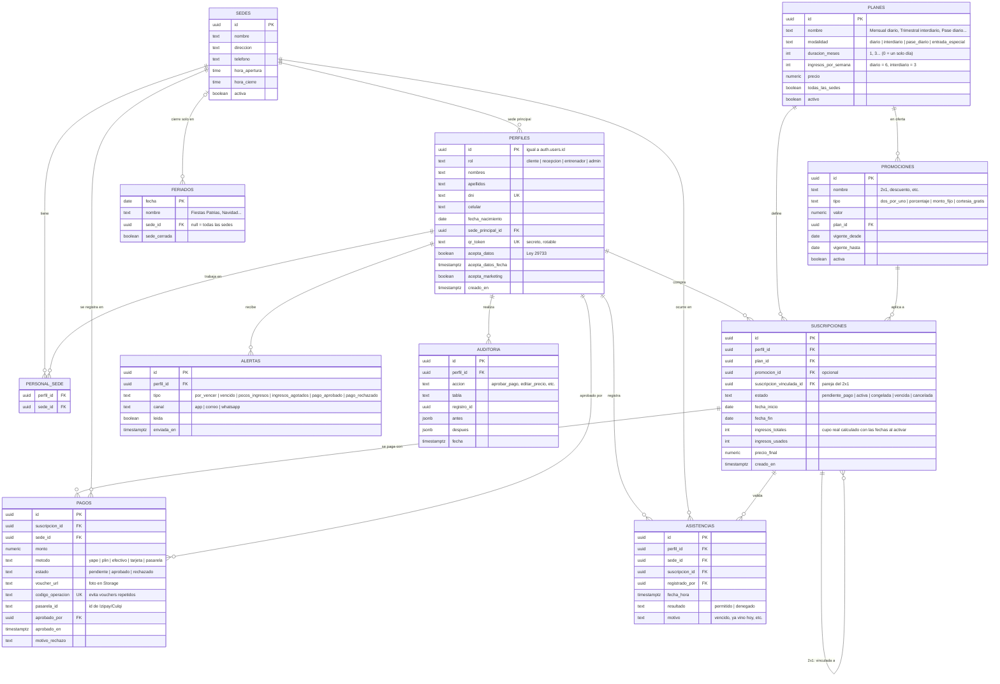
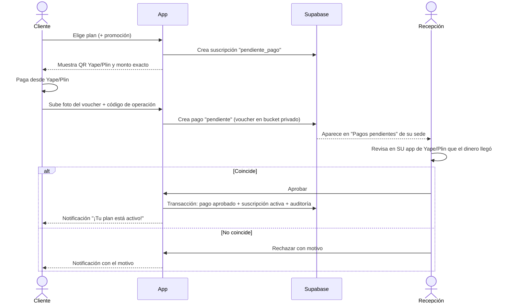

# PLAN — Aplicación URBAN FORCE GYM

> Documento de planificación. **No contiene código de la aplicación.**
> Gimnasio en Perú con **2 sedes**. Pensado para que un estudiante de 5.º ciclo de Ingeniería de Sistemas pueda construirlo paso a paso.

---

## 0. Resumen en una página

| Tema | Decisión |
|---|---|
| Tipo de app | Aplicación web instalable en el celular (**PWA**), *mobile-first* |
| Frontend + backend | **Next.js** (con **TypeScript**) |
| Estilos | **Tailwind CSS** con los colores de la marca (negro, amarillo dorado, blanco) |
| Base de datos, login y archivos | **Supabase** (PostgreSQL + Auth + Storage) |
| Hosting | **Vercel** |
| Pagos v1 | Yape / Plin con **QR del gimnasio + foto del voucher**, aprobado por recepción (0 % de comisión) |
| Pagos v2 | Pasarela **Izipay** (Yape + Plin + tarjetas). Alternativa: **Culqi** |
| Asistencia | **Código QR** personal del cliente, escaneado en recepción |
| Seguridad | Roles + **RLS por rol y por sede** en la base de datos |
| Legal | **Ley N.º 29733** (Protección de Datos Personales) |

---

## 1. Tecnologías elegidas y por qué

### 1.1 Next.js (framework web)
- **Qué es:** un framework construido sobre React para hacer aplicaciones web completas.
- **Por qué:** en un solo proyecto tienes las pantallas (frontend) y la lógica del servidor (rutas API / *Server Actions*). No necesitas mantener dos proyectos separados.
- **Lo que usaremos:** el *App Router* (carpeta `app/`), páginas protegidas por rol y rutas API para recibir los avisos (*webhooks*) de la pasarela de pagos.
- **Analogía:** es como tener recepción y almacén en el mismo local: todo cerca y ordenado.

### 1.2 TypeScript (lenguaje)
- **Qué es:** JavaScript con **tipos** (le dices al código que `precio` es un número y `dni` es un texto).
- **Por qué:** detecta errores **antes** de ejecutar. Por ejemplo, si intentas guardar una fecha donde va un monto, el editor te avisa. En una app con dinero (pagos) esto es muy importante.
- **Extra:** Supabase puede **generar los tipos automáticamente** a partir de tus tablas.

### 1.3 Tailwind CSS (estilos)
- **Qué es:** una forma de dar estilo usando clases cortas (`bg-black`, `text-yellow-400`, `p-4`) directamente en el HTML.
- **Por qué:** es rápido, fácil de mantener y viene pensado para **mobile-first** (primero diseñas para celular y luego agregas `md:` o `lg:` para pantallas grandes).
- **Lo que haremos:** definir los colores de la marca una sola vez en la configuración y usarlos en toda la app.

**Colores de marca (propuestos, por confirmar):**
El archivo `public/logo.png` **no está en el repositorio** (solo existe en la computadora del usuario), así que no se pudieron extraer los tonos exactos. Valores de partida:

| Nombre | Uso | Valor propuesto |
|---|---|---|
| `marca-negro` | Fondos, barra superior | `#0D0D0D` |
| `marca-dorado` | Botones principales, resaltados | `#F5B700` |
| `marca-dorado-oscuro` | Botón presionado, bordes | `#C99700` |
| `marca-blanco` | Textos sobre negro, tarjetas | `#FFFFFF` |
| `gris-suave` | Textos secundarios | `#A3A3A3` |

➡️ **Tarea (Fase 0):** subir `public/logo.png` al repo y sacar los colores exactos con un cuentagotas (por ejemplo, la herramienta cuentagotas de Figma, o "Selector de color" en cualquier editor de imágenes). Reemplazar los valores de la tabla.
➡️ Revisar el **contraste** (texto negro sobre dorado sí se lee; texto blanco sobre dorado **no**).

### 1.4 Supabase (base de datos + login + archivos)
- **Qué es:** un servicio en la nube que te da:
  - **PostgreSQL:** base de datos relacional (tablas, llaves foráneas, SQL de verdad).
  - **Auth:** registro e inicio de sesión (correo + contraseña, o enlace mágico).
  - **Storage:** para guardar las fotos de los vouchers de Yape/Plin y las fotos de perfil.
  - **RLS (Row Level Security):** reglas **dentro de la base de datos** que deciden qué filas puede ver o modificar cada usuario.
- **Por qué:** te ahorra construir un servidor desde cero y el plan gratuito alcanza para empezar.
- **Clave:** aunque alguien "hackee" el frontend, **RLS impide** que un cliente vea los datos de otro o que una recepcionista de la Sede A vea la caja de la Sede B.

### 1.5 Vercel (hosting)
- **Qué es:** la plataforma donde se publica la app (creada por los mismos autores de Next.js).
- **Por qué:** conectas tu repositorio de GitHub y **cada `git push` publica la app automáticamente**. Te da HTTPS gratis (obligatorio para PWA y para pagos).
- **Extra:** **Vercel Cron** sirve para tareas programadas, como revisar cada mañana qué membresías vencen pronto.

### 1.6 PWA (Progressive Web App)
- **Qué es:** una web que se puede **instalar** en el celular como si fuera una app, con ícono propio y pantalla completa.
- **Por qué:** no pagas la Play Store (US$ 25) ni la App Store (US$ 99/año), y una sola versión sirve para Android y iPhone.
- **Cómo la instala el cliente:**
  - **Android (Chrome):** abrir la web → menú ⋮ → **"Instalar aplicación"** (o "Agregar a pantalla principal"). Chrome también puede mostrar un aviso automático.
  - **iPhone (Safari):** abrir la web **en Safari** → botón **Compartir** (cuadrado con flecha) → **"Agregar a inicio"**. En iPhone **no** aparece un aviso automático, así que la app debe mostrar una pequeña guía con estos pasos.
- **Requisitos:** `manifest.json` (nombre, colores, íconos 192 px y 512 px) + HTTPS + *service worker*.

### 1.7 Otras librerías (pequeñas)
| Librería | Para qué |
|---|---|
| `zod` | Validar formularios (DNI de 8 dígitos, celular de 9 dígitos que empieza con 9) |
| Generador de QR (p. ej. `qrcode`) | Mostrar el QR personal del cliente |
| Lector de QR con cámara (p. ej. `html5-qrcode`) | Recepción escanea el QR desde el celular o la tablet |
| `date-fns` (con zona `America/Lima`) | Cálculo de fechas de vencimiento y días interdiarios |
| Resend o WhatsApp (v2) | Enviar alertas de vencimiento |

---

## 2. Base de datos

### 2.1 Diagrama (Mermaid `erDiagram`)



### 2.2 Explicación rápida de cada tabla
- **sedes:** las 2 sedes del gimnasio (se deja preparada para una 3.ª).
- **perfiles:** datos de **toda persona** que usa la app. El campo `rol` decide qué puede hacer. Se enlaza 1 a 1 con el usuario de Supabase Auth.
- **personal_sede:** en qué sede(s) trabaja cada recepcionista o entrenador. Es la base del RLS por sede.
- **planes:** catálogo de membresías. **Cada duración existe en dos modalidades**, diario e interdiario (por ejemplo "Mensual diario" y "Mensual interdiario"). También incluye el pase diario y la **entrada especial de S/ 10** para domingos y feriados. Las reglas están en las secciones 2.5 y 2.6.
- **feriados:** días en que las suscripciones y los pases gratuitos no valen.
- **promociones:** ofertas temporales (2x1, % de descuento, monto fijo).
- **suscripciones:** la membresía concreta de un cliente, con fechas y estado. En el **2x1** se crean **dos** suscripciones vinculadas entre sí.
- **pagos:** cada pago con su voucher. `codigo_operacion` es **único** para que nadie reutilice la misma captura de Yape.
- **asistencias:** cada escaneo del QR (también los **denegados**, para saber quién intentó entrar vencido).
- **alertas:** notificaciones enviadas al cliente.
- **auditoria:** quién aprobó qué y quién cambió precios. Protege a la recepción y al dueño.

### 2.3 Seguridad con RLS (por rol y por sede)

| Tabla | Cliente | Recepción | Entrenador | Admin |
|---|---|---|---|---|
| perfiles | Solo el suyo | Clientes de **su sede** (lectura + crear) | Clientes de su sede (lectura, sin datos de pago) | Todo |
| planes / promociones | Leer activos | Leer | Leer | CRUD |
| suscripciones | Solo las suyas | Ver/crear en su sede | Ver estado (activa/vencida) | Todo |
| pagos | Ver los suyos, subir voucher | Aprobar/rechazar **solo de su sede** | ❌ Sin acceso | Todo |
| asistencias | Ver las suyas | Registrar en su sede | Ver de su sede | Todo |
| auditoria | ❌ | ❌ | ❌ | Leer |

Reglas clave:
1. **RLS activado en todas las tablas** (en Supabase viene desactivado; hay que activarlo a mano).
2. Una función SQL `mi_rol()` y otra `trabajo_en_sede(sede_id)` para escribir las políticas sin repetir código.
3. **El cliente nunca puede cambiar su propio `rol`** ni el estado de un pago.
4. Aprobar un pago y activar la suscripción se hace en **una sola función SQL (transacción)**: o se hacen las dos cosas o ninguna.
5. La **clave `service_role`** de Supabase **solo** se usa en el servidor (webhook de pagos y cron), **nunca** en el navegador.

### 2.4 Ley N.º 29733 – Protección de Datos Personales (Perú)
- **Consentimiento informado:** casilla obligatoria **no marcada por defecto** al registrarse, con enlace a la *Política de Privacidad*. Guardar la fecha (`acepta_datos_fecha`).
- **Marketing aparte:** casilla **separada y opcional** para promociones por WhatsApp/correo.
- **Finalidad:** solo pedir los datos necesarios (DNI, nombre, celular, fecha de nacimiento). No pedir datos de salud salvo que sea indispensable; si se piden (lesiones), son **datos sensibles** y requieren consentimiento expreso por escrito.
- **Derechos ARCO:** pantalla o correo para que el cliente pida **A**cceso, **R**ectificación, **C**ancelación u **O**posición.
- **Banco de datos:** el gimnasio debe **inscribir su banco de datos** de clientes ante la Autoridad Nacional de Protección de Datos Personales (MINJUSDH).
- **Seguridad:** contraseñas gestionadas por Supabase Auth, HTTPS, RLS y vouchers en un *bucket* **privado** (se ven con enlaces temporales).
- **Proveedores fuera del Perú** (Supabase, Vercel): mencionarlo en la política de privacidad (flujo transfronterizo).

### 2.5 Regla de ingresos: modalidad diario e interdiario (confirmada)
Todos los planes (mensual, trimestral, etc.) se venden en **dos modalidades**:

| | **Diario** | **Interdiario** |
|---|---|---|
| Días en que vale la suscripción | Lunes a sábado que **no sean feriado** | Lunes a sábado que **no sean feriado** |
| Ingresos | 1 por día, todos los días válidos | **Cupo total** = 3 por semana (lunes a sábado), **depende del mes** |
| Cómo los usa | Cuando quiera, 1 por día | **Como quiera**, 1 por día: puede venir seguido, pero el cupo se le acaba antes |
| Al agotar el cupo | — (solo vence por fecha) | Se **deniega** el ingreso y se notifica |
| Ingresos no usados | — | **Se pierden** cuando termina el plan (no pasan al siguiente) |

**Cálculo del cupo del interdiario (depende del mes):**
- Se cuenta cuántos días de **lunes a sábado** hay entre `fecha_inicio` y `fecha_fin` y se **divide entre 2**, redondeando hacia abajo. Es lo mismo que "3 de cada 6 días", o sea, 3 por semana sin contar domingos.
- Ejemplos reales:
  - **Febrero 2026** (1 al 28): 24 días de lunes a sábado → cupo **12**.
  - **Octubre 2026** (1 al 31): 27 días de lunes a sábado → cupo **13**.
- El cupo se calcula **con las fechas reales al activar la suscripción** y se guarda en `ingresos_totales`. Así no cambia aunque luego se edite el plan.

**Otras reglas:**
- Cada ingreso **permitido** suma 1 a `ingresos_usados`. Máximo 1 ingreso por día en ambas modalidades. **No hay tope semanal**: el cliente reparte su cupo como quiera.
- La suscripción termina **por lo que ocurra primero**: llega a `fecha_fin` **o** (en interdiario) `ingresos_usados = ingresos_totales`. Si llega `fecha_fin` con ingresos sin usar, esos ingresos **se pierden**.

**Mensajes al cliente (interdiario):**
- **Ritmo:** si viene más seguido que 3 por semana, la app avisa: *"A este ritmo tus ingresos se acabarán el 18 de octubre, antes de que termine tu plan (31 de octubre)."*
- **Por agotarse:** cuando le quedan 2 ingresos: *"Te quedan 2 ingresos en tu plan interdiario."*
- **Agotado** (en la app y en la pantalla de recepción): *"Ya no tienes ingresos disponibles: completaste todos los ingresos de tu plan interdiario. Renueva tu plan para seguir entrenando."* + botón **Renovar**.
- **Fin cercano con ingresos sin usar:** 3 días antes de `fecha_fin`: *"Te quedan 4 ingresos y tu plan termina el 31 de octubre. Los ingresos no usados se pierden."*

### 2.6 Domingos y feriados
El gimnasio **abre los domingos**, pero ese día **ninguna suscripción es válida** (ni diaria ni interdiaria).

| Día | ¿Vale la suscripción? | ¿Valen los pases gratuitos o de cortesía? | ¿Cómo entra el cliente? |
|---|---|---|---|
| Lunes a sábado normal | ✅ | ✅ | Con su QR |
| **Domingo** | ❌ | ❌ **No se aceptan** | **Entrada suelta de S/ 10**, pagada en recepción |
| **Feriado** | ❌ | ❌ **No se aceptan** | **Entrada suelta de S/ 10**, pagada en recepción |

- **Tabla nueva `feriados`:** fecha y nombre, cargada por el admin cada año, por ejemplo 28 y 29 de julio. Si una sede cierra ese día, se indica la sede.
- **Plan especial `entrada_especial`:** precio configurable, hoy **S/ 10**. Recepción lo vende en 2 toques.
- **Escaneo en domingo o feriado:** el QR muestra: *"Hoy es domingo/feriado: tu plan no aplica. Entrada: S/ 10."* con el botón **Cobrar entrada**.
- **Cupo del interdiario:** un domingo o feriado **no consume** ingresos del plan. Los feriados de lunes a sábado **no reducen** el cupo, porque el cliente puede venir otro día.
- **En resumen:** domingos y feriados tienen la misma regla. Solo se entra con la entrada de S/ 10.

Toda esta lógica vive en `lib/reglas/ingresos.ts` y en la función SQL que registra la asistencia, para que no se pueda saltar desde el navegador. Tendrá pruebas automáticas para cada caso:
- domingo y feriado
- pase gratuito usado en domingo o feriado
- dos ingresos el mismo día
- cupo de febrero frente a octubre
- último ingreso del cupo
- plan vencido por fecha con ingresos sobrantes

---

## 3. Pantallas por rol

> Todas se diseñan primero para **celular** (ancho de 360 px) con botones grandes y la barra de navegación abajo.

### 3.1 Público (sin iniciar sesión)
1. **Inicio:** logo, sedes, horarios, planes y promociones vigentes, botón "Únete".
2. **Registro:** datos + consentimiento Ley 29733.
3. **Iniciar sesión / Recuperar contraseña.**
4. **Política de privacidad y Términos.**
5. **Cómo instalar la app** (guía Android / iPhone).

### 3.2 Cliente
1. **Mi membresía:** plan y modalidad (diario / interdiario), estado (color verde / amarillo / rojo), días que faltan. Si es interdiario, muestra el uso del cupo y, si va muy rápido, el aviso de ritmo:
   - **"Ingresos: 7 de 13 usados"**
   - *"A este ritmo se acaban el 18 de octubre"*
2. **Mi QR:** QR grande a pantalla completa y con brillo alto para escanear en recepción.
3. **Comprar / Renovar plan:** elegir plan y promoción → pagar.
4. **Pagar:** QR de Yape/Plin del gimnasio + subir foto del voucher + código de operación (v1) · botón de pasarela (v2).
5. **Mis pagos:** historial y estado (pendiente, aprobado, rechazado con motivo).
6. **Mis asistencias:** calendario de días que fue.
7. **Notificaciones.**
8. **Mi perfil:** datos, cambiar contraseña, derechos ARCO.

### 3.3 Recepción (solo su sede)
1. **Escanear QR:** abre la cámara → muestra foto, nombre y un **semáforo grande**: ✅ PUEDE PASAR / ❌ NO PUEDE PASAR + motivo.
2. **Buscar cliente** por DNI o nombre (por si olvidó el celular).
3. **Pagos pendientes:** lista con la foto del voucher → **Aprobar** / **Rechazar** (con motivo).
4. **Registrar cliente nuevo** en mostrador.
5. **Cobro en efectivo**, venta de **pase diario** y de la **entrada de S/ 10** para domingos y feriados.
6. **Asistencias de hoy** de su sede.
7. **Cierre de caja del día** (total por método: efectivo, Yape, Plin).

### 3.4 Entrenador
1. **Clientes presentes ahora** en su sede.
2. **Buscar cliente** y ver estado de membresía (sin montos).
3. **Ficha básica** del cliente (versión 2: rutinas y progreso).

### 3.5 Administrador (dueño)
1. **Dashboard:** ingresos del mes, socios activos, por vencer, nuevos; comparación Sede A vs Sede B.
2. **Planes:** crear, editar precio, activar/desactivar.
3. **Promociones:** crear 2x1, descuentos, fechas de vigencia.
4. **Personal:** crear usuarios de recepción/entrenadores y asignarles sede.
5. **Sedes.**
6. **Clientes:** buscar, editar, congelar membresía.
7. **Reportes:** pagos por fecha/sede/método, exportar a Excel (CSV).
8. **Auditoría:** quién aprobó qué.
9. **Configuración:** días de aviso de vencimiento, QR de Yape/Plin, reglas del interdiario.

---

## 4. Flujos principales

### 4.1 Compra de un plan (v1: Yape/Plin manual)

Reglas: el `codigo_operacion` no se puede repetir; el monto del voucher debe ser igual al `precio_final`.

### 4.2 Compra con pasarela (v2: automático)
1. El cliente elige plan → el **servidor** crea el cobro en Izipay con el monto (el precio **nunca** lo manda el navegador).
2. El cliente paga con Yape, Plin o tarjeta en el formulario de la pasarela.
3. La pasarela avisa al servidor mediante un **webhook** → se **verifica la firma** → pago `aprobado` y suscripción `activa` sin intervención humana.
4. Si el webhook llega dos veces, no se duplica nada (se revisa `pasarela_id`).

### 4.3 Ingreso con QR
1. El cliente abre **Mi QR**. El QR contiene un `qr_token` **aleatorio**, no el DNI.
2. Recepción escanea → el servidor busca al cliente y revisa:
   - ¿Tiene suscripción **activa** y `fecha_fin ≥ hoy`?
   - ¿El plan permite **esta sede**?
   - ¿Hoy es **domingo o feriado**? → no aplican ni la suscripción ni los pases gratuitos. Se ofrece **cobrar entrada de S/ 10** (sección 2.6).
   - ¿Ya registró ingreso **hoy**? (evita doble escaneo; máximo 1 por día)
   - Si es **interdiario**: ¿`ingresos_usados < ingresos_totales`? (sección 2.5)
3. Resultado en pantalla grande (✅/❌) y se guarda en `asistencias` **siempre**, incluso si es denegado.
   - Si fue permitido: `ingresos_usados + 1`. Si con ese ingreso le quedan 2 → alerta `pocos_ingresos`; si llegó al cupo → estado `vencida` + alerta `ingresos_agotados`.
   - Si fue denegado por cupo: motivo *"Completó todos los ingresos de su plan interdiario"* y el cliente recibe la notificación con el botón **Renovar**.
4. Si el cliente perdió el celular o alguien copió su QR → admin **regenera** el `qr_token`.

### 4.4 Alertas de vencimiento
1. **Vercel Cron** ejecuta una tarea todos los días a las **7:00 a. m. (hora de Lima)**.
2. Busca suscripciones que vencen en **N días** (N configurable, ver dudas) y las del día.
3. Crea la alerta en la app (y en v2 correo/WhatsApp) con un botón **"Renovar"**.
4. Marca como `vencida` las suscripciones cuya `fecha_fin` ya pasó.
5. En recepción, el escáner muestra **amarillo** si al cliente le quedan ≤ N días, para recordárselo en persona.

### 4.5 Promoción 2x1
1. El titular compra el plan con la promoción 2x1 y escribe el **DNI o celular del acompañante**.
2. Si el acompañante no tiene cuenta, se le envía una invitación; debe registrarse y **aceptar la Ley 29733 él mismo** (no se puede registrar a otra persona sin su consentimiento).
3. Se crean **dos suscripciones** vinculadas (`suscripcion_vinculada_id`) y **un solo pago**.
4. Cada uno tiene **su propio QR** y su propio control de asistencias.

---

## 5. Estructura de carpetas (propuesta)

> Proyecto **nuevo y separado** (por ejemplo `urban-force-gym/`). No se mezcla con el código de *aula-ia-cientifica* que ya existe en este repositorio.

```
urban-force-gym/
├── app/                          # Pantallas (App Router de Next.js)
│   ├── (publico)/                # Inicio, planes, registro, login, privacidad
│   ├── (cliente)/                # mi-membresia, mi-qr, comprar, pagos, asistencias, perfil
│   ├── (recepcion)/              # escanear, pagos-pendientes, clientes, caja
│   ├── (entrenador)/             # presentes, clientes
│   ├── (admin)/                  # dashboard, planes, promociones, personal, sedes, reportes, auditoria
│   ├── api/
│   │   ├── webhooks/pasarela/    # Recibe avisos de Izipay/Culqi (v2)
│   │   └── cron/vencimientos/    # Tarea diaria de alertas
│   ├── layout.tsx
│   └── manifest.ts               # Datos de la PWA
├── components/
│   ├── ui/                       # Botones, tarjetas, inputs con colores de marca
│   ├── qr/                       # Mostrar QR y escáner
│   └── navegacion/               # Barra inferior por rol
├── lib/
│   ├── supabase/                 # Cliente para navegador y para servidor
│   ├── reglas/                   # Lógica de negocio: interdiario, vencimiento, 2x1
│   ├── pagos/                    # Adaptador de pasarela (Izipay/Culqi)
│   └── validaciones/             # Esquemas zod (DNI, celular…)
├── supabase/
│   ├── migrations/               # SQL de tablas, funciones y políticas RLS (versionado)
│   └── seed.sql                  # Datos de prueba: 2 sedes, planes, usuarios de cada rol
├── public/
│   ├── logo.png
│   └── iconos/                   # 192x192 y 512x512 para la PWA
├── tests/                        # Pruebas de reglas de negocio y de RLS
├── .env.example                  # Nombres de variables (sin valores reales)
└── README.md
```

¿Por qué `lib/reglas/` aparte? Porque la lógica del interdiario o del 2x1 es **lo que más va a cambiar** y lo que más se debe probar. Separada de las pantallas es fácil de testear.

---

## 6. Fases de desarrollo (tareas pequeñas y en orden)

> Cada tarea debería caber en **una sesión de trabajo** (1–3 horas) y terminar con un `git commit`.

### Fase 0 — Preparación
1. Confirmar las dudas de la sección 8 con el dueño.
2. Subir `logo.png` y extraer los colores exactos.
3. Crear cuentas: GitHub, Supabase, Vercel.
4. Crear el proyecto Next.js + TypeScript + Tailwind.
5. Configurar colores de marca y fuente en Tailwind.
6. Publicar un "Hola URBAN FORCE" en Vercel (comprobar que el despliegue automático funciona).

### Fase 1 — Base de datos y seguridad
7. Migración: tablas `sedes`, `perfiles`, `personal_sede`.
8. Migración: `planes`, `promociones`.
9. Migración: `suscripciones`, `pagos`, `asistencias`, `alertas`, `auditoria`.
10. Funciones `mi_rol()` y `trabajo_en_sede()`.
11. Políticas RLS tabla por tabla.
12. `seed.sql` con 2 sedes, planes y un usuario de cada rol.
13. **Pruebas de RLS:** un cliente no ve a otro; recepción de Sede A no ve pagos de Sede B.

### Fase 2 — Autenticación y roles
14. Registro con consentimiento Ley 29733.
15. Login, logout, recuperar contraseña.
16. Redirección según rol después del login.
17. Protección de rutas (un cliente no entra a `/admin`).
18. Barra de navegación inferior según rol.

### Fase 3 — Administración básica
19. CRUD de sedes.
20. CRUD de planes.
21. CRUD de promociones.
22. Crear personal y asignar sede.

### Fase 4 — Compra y pago manual (v1)
23. Pantalla de planes para el cliente.
24. Crear suscripción `pendiente_pago`.
25. Pantalla de pago con QR Yape/Plin + subida de voucher al bucket privado.
26. Lista de pagos pendientes en recepción.
27. Función SQL "aprobar pago" (transacción + auditoría).
28. Rechazar pago con motivo.
29. Pantalla "Mi membresía" con estado y días restantes.
30. Cobro en efectivo y pase diario en recepción.

### Fase 5 — Asistencia con QR
31. Generar `qr_token` y pantalla "Mi QR".
32. Escáner con cámara en recepción.
33. Reglas de ingreso en `lib/reglas/` **con pruebas**: diario, interdiario (cupo según el mes), pase diario, domingos, feriados, cortesías en domingo o feriado y sede.
33b. Tabla `feriados` + pantalla del admin para cargarlos + botón "Cobrar entrada S/ 10" en el escáner.
34. Registrar asistencias permitidas y denegadas.
35. Búsqueda manual por DNI.
36. Regenerar QR (admin).

### Fase 6 — Alertas y reportes
37. Cron diario de vencimientos.
38. Notificaciones dentro de la app.
39. Dashboard del admin.
40. Cierre de caja de recepción.
41. Reportes + exportar CSV.

### Fase 7 — PWA y pulido
42. `manifest`, íconos y *service worker*.
43. Pantalla "Cómo instalar" (Android / iPhone).
44. Pruebas en celulares reales (Android de gama baja + iPhone).
45. Política de privacidad y términos.
46. Revisión de accesibilidad y contraste.

### Fase 8 — Piloto
47. Probar **2 semanas en una sola sede** con clientes reales.
48. Corregir según lo que diga recepción.
49. Activar la segunda sede.

### Fase 9 — Versión 2
50. Pasarela de pagos (sección 7).
51. Promoción 2x1 con invitación.
52. Alertas por WhatsApp/correo.
53. Congelamiento de membresía.
54. Rutinas y progreso para entrenadores.

---

## 7. Pagos reales: pasarela recomendada, activación y costos

### 7.1 Comparación de pasarelas en Perú (referencial, set. 2026)

| Pasarela | Yape | Plin | Tarjetas | Comisión aprox. | Abono | Observación |
|---|---|---|---|---|---|---|
| **Izipay** | ✅ | ✅ | ✅ | ~3.44 %–3.99 % + IGV (negociable con volumen) | ~24 h hábiles | Web + POS físico con el mismo proveedor |
| **Culqi** | ✅ | ⚠️ confirmar | ✅ | 3.44 % + US$ 0.20 + IGV online; **mínimo S/ 3.50** en montos < S/ 87.72 | hasta ~4 días hábiles | Documentación y *sandbox* muy buenos para estudiantes |
| **Niubiz** | ✅ | ✅ | ✅ | Negociable | Variable | Más orientado a empresas grandes |
| **Mercado Pago** | ✅ (QR interoperable) | ✅ (QR interoperable) | ✅ | ~3.99 % + IGV (abono al día siguiente) | Inmediato / 1 día | El cliente es redirigido a la página de Mercado Pago |

Fuentes: [Riqra](https://blog.riqra.com/posts/pasarelas-pago-online-peru), [Culqi – precios](https://culqi.com/precios/), [Alaz](https://alaz.pe/blog/pasarela-de-pago-peru-como-elegir-culqi-stripe-izipay-niubiz), [Adratech](https://adratechsystems.com/recursos/izipay-vs-niubiz-vs-culqi-comparativa-peru), [DevSprinters](https://devsprinters.site/blog/comparativa-pasarelas-pago-peru-2026), [Kom.pe](https://kom.pe/izipay-vs-niubiz-vs-culqi/). **Las tarifas cambian: confirmarlas con un asesor antes de firmar.**

### 7.2 Recomendación
- **Versión 1:** **Yape/Plin directo con QR del gimnasio + aprobación de recepción.** Comisión 0 %, se puede lanzar ya y es como trabaja hoy la recepción.
  - ⚠️ Yape/Plin de persona natural tienen **límites diarios** y no son para uso comercial intensivo. Lo ideal es usar **Yape Empresas / cuenta de negocio** a nombre del gimnasio.
- **Versión 2:** **Izipay**, porque acepta **Yape y Plin** (los dos que usan los clientes peruanos), abona en ~24 h y también ofrece POS para recepción.
  - **Alternativa:** **Culqi** si se prioriza la facilidad de integración; verificar primero el soporte para Plin y tener en cuenta el **mínimo de S/ 3.50**, que encarece el pase diario.
- El código se escribe con un **adaptador** (`lib/pagos/`) para cambiar de pasarela sin rehacer las pantallas.

### 7.3 Modo de prueba (listo desde el inicio)
- Todas estas pasarelas tienen **sandbox** con **llaves de prueba** y tarjetas ficticias: no se mueve dinero real.
- Variables de entorno (en `.env.local` y en Vercel, **nunca** en GitHub):
  ```
  PAGOS_MODO=prueba            # prueba | produccion
  PAGOS_LLAVE_PUBLICA=...      # llave de PRUEBA
  PAGOS_LLAVE_SECRETA=...      # solo servidor
  PAGOS_WEBHOOK_SECRETO=...    # para verificar la firma
  ```
- En modo `prueba` la app muestra una franja amarilla: **"MODO PRUEBA – no se cobra dinero real"**.

### 7.4 Pasos para activar pagos reales
1. El gimnasio necesita **RUC** (persona jurídica o persona natural con negocio) y una **cuenta bancaria a nombre del RUC**.
2. Llenar la afiliación en la web de la pasarela (DNI del representante, RUC, cuenta bancaria, página web con **términos, política de devoluciones y datos de contacto** visibles).
3. Esperar la validación (normalmente de días a un par de semanas).
4. Recibir las **llaves de producción**.
5. En Vercel: cambiar `PAGOS_MODO=produccion` y reemplazar las llaves.
6. Registrar la URL del webhook en el panel de la pasarela.
7. Hacer **1 pago real pequeño** (por ejemplo, un pase diario) y **reembolsarlo** para confirmar todo.
8. Revisar con el contador la emisión de **boletas/facturas electrónicas (SUNAT)**. La pasarela **no** emite comprobantes; puede integrarse un proveedor de facturación en una fase futura.

### 7.5 Costos estimados

| Concepto | Inicio | Cuando crezca |
|---|---|---|
| Vercel | **Gratis** (plan Hobby)* | Pro ~US$ 20/mes |
| Supabase | **Gratis** (500 MB BD, 1 GB archivos) | Pro ~US$ 25/mes |
| Dominio `.com` o `.pe` | ~S/ 50–150 al año | igual |
| Pasarela | S/ 0 fijo, solo comisión por venta | comisión negociable |
| Correo (Resend) | Gratis hasta ~3 000/mes | desde ~US$ 20/mes |
| WhatsApp Business API | — | pago por conversación |
| Tiendas de apps | **S/ 0** (es PWA) | — |

\* El plan Hobby de Vercel es para uso **no comercial**; para el gimnasio en producción lo correcto es **Vercel Pro**. Supabase gratis **pausa** el proyecto tras 1 semana sin uso, lo que no pasa si se usa a diario.

**Ejemplo de comisión:** mensualidad de S/ 100 con Izipay a ~3.44 % + IGV ≈ **S/ 4.06** de comisión → el gimnasio recibe ≈ S/ 95.94.

---

## 8. Dudas a confirmar con el dueño (antes de programar)

1. ~~**Diario, interdiario, domingos y feriados.**~~ ✅ **Confirmado.** Ver secciones 2.5 y 2.6.
2. **2x1 con dos cuentas.** ¿Las dos personas deben inscribirse el **mismo día**? ¿Deben tener el **mismo plan y la misma fecha de vencimiento**? ¿Si uno congela, el otro también? ¿Se puede cambiar de acompañante?
3. **Umbral de vencimiento.** ¿Con cuántos días de anticipación avisar (3, 5, 7)? ¿Hay **días de tolerancia** después de vencer? ¿Se puede renovar antes y que los días se sumen?
4. **Pase diario.** ¿Precio? ¿Vale para **cualquier sede**? ¿Se vende solo en recepción o también en la app? ¿Se pide DNI / registro completo o solo nombre? ¿Vale para el día calendario o por 24 horas?
5. **Sedes.** ¿Todos los planes permiten entrar a las 2 sedes o hay planes por sede? ¿Los precios son iguales en ambas?
6. **Congelamiento.** ¿Se permite congelar (viajes, lesiones)? ¿Cuántos días como máximo?
7. **Horarios.** ¿Hay planes con horario restringido (por ejemplo, solo mañanas)?
8. **Menores de edad.** ¿Se aceptan? (La Ley 29733 exige consentimiento de los padres para menores de 14 años.)
9. **Comprobantes.** ¿El gimnasio emite boleta electrónica hoy? ¿Con qué sistema?
10. **Titular de los cobros.** ¿A nombre de quién están el Yape/Plin y el RUC del negocio?
11. **Colores del logo.** Confirmar los códigos exactos (sección 1.3).
12. **Devoluciones.** ¿Existe una política de devolución o cambio de plan?

---

*Fin del plan. Siguiente paso: resolver las dudas de la sección 8 y empezar la Fase 0.*
